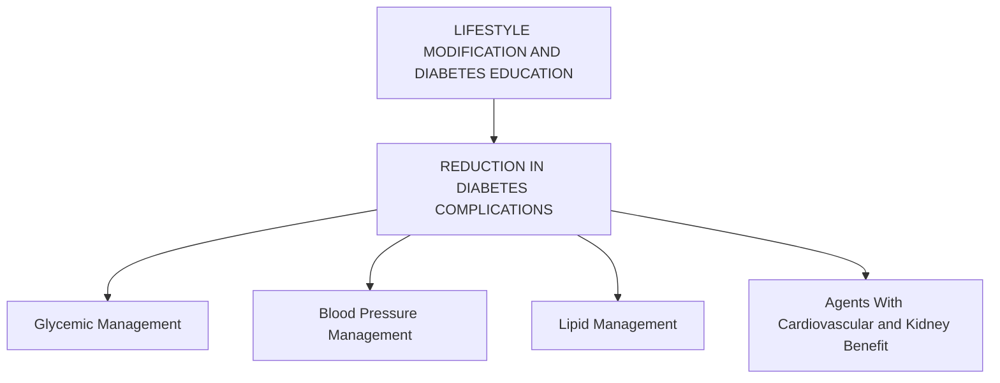

# 10. Cardiovascular Disease and Risk Management: Standards of Care in Diabetes—2025

Diabetes Care 2025;48(Suppl. 1):S207–S238 | https://doi.org/10.2337/dc25-S010

Downloaded from http://diabetesjournals.org/care/article-pdf/48/Supplement_1/S207/791453/dc25s010.pdf by guest on 16 December 2024

# 10. CARDIOVASCULAR DISEASE AND RISK MANAGEMENT

The American Diabetes Association (ADA) “Standards of Care in Diabetes” includes the ADA’s current clinical practice recommendations and is intended to provide the components of diabetes care, general treatment goals and guidelines, and tools to evaluate quality of care. Members of the ADA Professional Practice Committee, an interprofessional expert committee, are responsible for updating the Standards of Care annually, or more frequently as warranted. For a detailed description of ADA standards, statements, and reports, as well as the evidence-grading system for ADA’s clinical practice recommendations and a full list of Professional Practice Committee members, please refer to Introduction and Methodology. Readers who wish to comment on the Standards of Care are invited to do so at professional.diabetes.org/SOC.

For prevention and management of diabetes complications in children and adolescents, please refer to Section 14, “Children and Adolescents.”

Atherosclerotic cardiovascular disease (ASCVD) broadly refers to a history of acute coronary syndrome, myocardial infarction (MI), stable or unstable angina or coronary or other arterial revascularization, stroke, transient ischemic attack, or peripheral artery disease (PAD) including aortic aneurysm and is the leading cause of morbidity and mortality in people with diabetes (1). Diabetes itself confers independent ASCVD risk, and among people with diabetes, all major cardiovascular risk factors, including hypertension, hyperlipidemia, and obesity, are clustered and common (2). Numerous studies have shown the efficacy of managing individual cardiovascular risk factors in preventing or slowing ASCVD in people with diabetes. Furthermore, large benefits are seen when multiple cardiovascular risk factors (glycemic, blood pressure, and lipid management) are addressed simultaneously, with evidence for long-lasting benefits (3–5). Notably, most of the evidence supporting interventions to reduce cardiovascular risk in diabetes comes from trials of people with type 2 diabetes. No randomized trials have been specifically designed to assess the impact of cardiovascular risk reduction strategies in people with type 1 diabetes. Therefore, the recommendations for cardiovascular risk factor modification for people with type 1 diabetes are extrapolated from data obtained in people with type 2 diabetes and are similar to those for people with type 2 diabetes.

Under the current paradigm of comprehensive risk factor modification, cardiovascular morbidity and mortality have notably decreased in people with both type 1 and type 2 diabetes (1). In addition to the evidence from prospective intervention studies to support comprehensive ASCVD risk factor reduction, a large cohort study confirmed no or only marginally increased mortality, MI, and stroke risk compared with the general population when all major cardiovascular risk factors are managed to goal levels in people with type 2 diabetes (6). Despite these encouraging opportunities to reduce morbidity and mortality, cardiovascular risk factors are predicted to

*A complete list of members of the American Diabetes Association Professional Practice Committee can be found at https://doi.org/10.2337/dc25-SINT. This section has received endorsement from the American College of Cardiology. Duality of interest information for each author is available at https://doi.org/10.2337/dc25-SDIS. Suggested citation: American Diabetes Association Professional Practice Committee. 10. Cardiovascular disease and risk management: Standards of Care in Diabetes—2025. Diabetes Care 2025;48(Suppl. 1): S207–S238 © 2024 by the American Diabetes Association. Readers may use this article as long as the work is properly cited, the use is educational and not for profit, and the work is not altered. More information is available at https://www.diabetesjournals.org/journals/pages/license.

---

S208 Cardiovascular Disease and Risk Management                                                             Diabetes Care Volume 48, Supplement 1, January 2025

increase and only a minority of people with type 2 diabetes achieve recommended risk factor goals and are treated with guideline-recommended therapy (7–9). Therefore, continued focus on delivering high-quality comprehensive cardiovascular care and on addressing barriers to risk factor management are required to implement the treatment recommendations (1,10) outlined in this section.

Diabetes is also an important risk factor for incident heart failure, which is at least twofold more prevalent in people with diabetes compared with those without diabetes and is a major cause of morbidity and mortality (11). People with diabetes may present with a wide spectrum of heart failure, including heart failure with preserved ejection fraction (HFpEF), heart failure with mildly reduced ejection fraction (HFmEF), or heart failure with reduced ejection fraction (HFrEF) (12). Comorbid conditions including excess body weight and hypertension often precede the development of HFpEF and have been implicated in the pathophysiology of HFpEF (13). Coronary artery disease and prior MI are major risk factors and a cause of myocardial injury in ischemic heart disease leading to HFrEF. In addition, people with diabetes are at risk for developing structural heart disease and HFrEF in the absence of obstructive coronary artery disease (14). The pathophysiology of heart failure in people with diabetes and further details of screening, diagnosis, and treatment of people with heart failure and diabetes are also outlined in a previous consensus statement by the American Diabetes Association (ADA) (15).

There is an increasing appreciation of the common pathophysiology and interrelationship of cardiometabolic risk factors leading to both adverse cardiovascular and adverse kidney outcomes in people with diabetes, including ASCVD, heart failure, and chronic kidney disease (CKD) (16). These three comorbidities are frequently caused by metabolic risk, which is frequently driven by obesity and its associated risk factors, and the incidence of all three conditions rises with increasing A1C levels (17). Collectively, this combination of comorbidities has been termed cardiorenal metabolic disease or cardiovascular-kidney-metabolic health (18,19). Reasons to concurrently consider cardiovascular and kidney comorbidities in the management of people with diabetes include not only the common metabolic risk but also the major benefit observed across the spectrum of cardiovascular disease, heart failure, and renal outcomes in people with type 2 diabetes treated with sodium–glucose cotransporter 2 (SGLT2) inhibitors or glucagon-like peptide 1 receptor agonists (GLP-1 RAs). Therefore, in addition to the management of hyperglycemia, hypertension, and hyperlipidemia, treatment with SGLT2 inhibitors and/or GLP-1 RAs that have demonstrated benefit is considered a fundamental element of risk reduction and the pharmacological strategy to improve cardiovascular and kidney outcomes in people with type 2 diabetes (Fig. 10.1). In addition to the standards of care for the prevention and treatment of cardiovascular disease outlined below, the reader is referred to Section 9, "Pharmacologic Approaches to

Figure 10.1—Multifactorial approach to reduction in risk of diabetes complications.

---

# Cardiovascular Disease and Risk Management

# HYPERTENSION AND BLOOD PRESSURE MANAGEMENT

An elevated blood pressure is defined as a systolic blood pressure 120–129 mmHg and a diastolic blood pressure <80 mmHg (20). Hypertension is defined as a systolic blood pressure ≥130 mmHg or a diastolic blood pressure ≥80 mmHg (20). This is in agreement with the definition of hypertension by the American College of Cardiology and American Heart Association (20). Hypertension is common among people with either type 1 or type 2 diabetes. Hypertension is a major risk factor for ASCVD, heart failure, and microvascular complications. Moreover, numerous studies have shown that antihypertensive therapy reduces ASCVD events, heart failure, and microvascular complications. Please refer to the ADA position statement “Diabetes and Hypertension” for a detailed review of the epidemiology, diagnosis, and treatment of hypertension (21) and hypertension guideline recommendations (22–25).

# Screening and Diagnosis Recommendations

10.1 Blood pressure should be measured at every routine clinical visit, or at least every 6 months. Individuals found to have elevated blood pressure without a diagnosis of hypertension (systolic blood pressure 120–129 mmHg and diastolic blood pressure <80 mmHg) should have blood pressure confirmed using multiple readings, including measurements on a separate day, to diagnose hypertension. A Hypertension is defined as a systolic blood pressure ≥130 mmHg or a diastolic blood pressure ≥80 mmHg based on an average of two or more measurements obtained on two or more occasions. A Individuals with blood pressure ≥180/110 mmHg and cardiovascular disease could be diagnosed with hypertension at a single visit. E

# Treatment Goals Recommendations

10.3 For people with diabetes and hypertension, blood pressure goals should be individualized through a shared decision-making process that addresses cardiovascular risk, potential adverse effects of antihypertensive medications, and individual preferences. B 10.4 The on-treatment blood pressure goal is <130/80 mmHg, if it can be safely attained. A

Randomized clinical trials have demonstrated unequivocally that treatment of hypertension reduces cardiovascular events as well as microvascular complications. There has been controversy on the recommendation of a specific blood pressure goal in people with diabetes. The committee recognizes that there has been no randomized controlled trial to specifically demonstrate a decreased incidence of cardiovascular events in people with diabetes by achieving a blood pressure <130/80 mmHg. The recommendation to support a blood pressure goal of <130/80 mmHg in people with diabetes is consistent with guidelines from the American College of Cardiology and American Heart Association (21), the International Society of Hypertension, and Europe European Society of Cardiology/European Society of Hypertension Blood Pressure/Hypertension Guidelines (24).

The committee’s recommendation for the blood pressure goal of <130/80 mmHg derives primarily from the collective evidence of the following randomized controlled trials. The Systolic Blood Pressure Intervention Trial (SPRINT) demonstrated that treatment to a goal systolic blood pressure of <120 mmHg decreases cardiovascular event rates by 25% in high-risk individuals, although people with diabetes were excluded from this trial (38). The Strategy of Blood Pressure Intervention in the Elderly Hypertensive Patients (STEP) trial included nearly 20% of people with diabetes and noted decreased cardiovascular events with treatment of hypertension to a systolic blood pressure goal of <130 mmHg (39).

---

# Cardiovascular Disease and Risk Management

# Diabetes Care Volume 48, Supplement 1, January 2025

(ACCORD BP) did not confirm that aiming for a systolic blood pressure <120 mmHg in people with diabetes results in decreased cardiovascular event rates, the prespecified secondary outcome of stroke was reduced by 41% with intensive treatment (40). The Action in Diabetes and Vascular Disease: Preterax and Diamicron MR Controlled Evaluation (ADVANCE) trial revealed that treatment with perindopril and indapamide to an achieved systolic blood pressure of 135 mmHg significantly decreased cardiovascular event rates compared with a placebo treatment with an achieved blood pressure of 140 mmHg (41). Therefore, it is recommended that people with diabetes who have hypertension should be treated to blood pressure goals of <130/80 mmHg. Notably, there is an absence of high-quality data available to guide blood pressure goals in people with type 1 diabetes, but a similar blood pressure goal of <130/80 mmHg is recommended for people with type 1 diabetes. As discussed below, treatment should be individualized, and treatment goals should not be set to achieve <120/80 mmHg, as a mean achieved blood pressure <120/80 mmHg is associated with adverse events. For more information on individualized blood pressure goals in older individuals, please see Section 13, “Older Adults.”

# Randomized Controlled Trials of Intensive Versus Standard Blood Pressure Management

SPRINT provides the strongest evidence to support lower blood pressure goals in individuals at increased cardiovascular risk, although this trial excluded people with diabetes (38). The trial enrolled 9,361 individuals with a systolic blood pressure of $130 mmHg and increased cardiovascular risk and treated to a systolic blood pressure goal of <120 mmHg (intensive treatment) versus a goal of <140 mmHg (standard treatment). The primary composite outcome of MI, coronary syndromes, stroke, heart failure, or death from cardiovascular causes was reduced by 25% in the intensive treatment group. The achieved systolic blood pressures in the trial were 121 mmHg and 136 mmHg in the intensive versus standard treatment group, respectively. Adverse outcomes, including hypotension, syncope, electrolyte abnormality, and acute kidney injury (AKI), were more common in the intensive treatment arm; risk of adverse outcomes needs to be weighed against the cardiovascular benefit of more intensive blood pressure lowering.

ACCORD BP provides the strongest direct assessment of the benefits and risks of intensive blood pressure management in people with type 2 diabetes (40). In the study, a total of 4,733 individuals with type 2 diabetes were assigned to intensive therapy (aiming for a systolic blood pressure <120 mmHg) or standard therapy (aiming for a systolic blood pressure <140 mmHg). The mean achieved systolic blood pressures were 119 mmHg and 133 mmHg in the intensive and standard groups, respectively. The primary composite outcome of nonfatal MI, nonfatal stroke, or death from cardiovascular causes was not significantly reduced in the intensive treatment group. The prespecified secondary outcome of stroke was significantly reduced by 41% in the intensive treatment group.

The Hypertension Optimal Treatment (HOT) trial enrolled 18,790 individuals and aimed for a diastolic blood pressure <90 mmHg, <85 mmHg, or <80 mmHg (42). The cardiovascular event rates, defined as fatal or nonfatal MI, fatal and nonfatal strokes, and all other cardiovascular events, were not significantly different between diastolic blood pressure goals (#90 mmHg, #85 mmHg, and #80 mmHg), although the lowest incidence of cardiovascular events occurred with an achieved diastolic blood pressure of 82 mmHg. However, in people with diabetes, there was a significant 51% reduction in the treatment group with a goal diastolic blood pressure of <80 mmHg compared with a goal diastolic blood pressure of <90 mmHg.

# Meta-analyses of Trials

To clarify optimal blood pressure goals in people with diabetes, multiple meta-analyses have been performed. One of the largest meta-analyses included 73,913 people with diabetes. Compared with a less intensive blood pressure management, allocation to a tighter blood pressure management significantly reduced the risk of stroke by 31% but did not reduce the risk of MI (43). Another meta-analysis of 19 trials that included 44,989 individuals showed that a mean blood pressure of 133/76 mmHg is associated with a 14% risk reduction for major cardiovascular events compared with a mean blood pressure of 140/81 mmHg (37). This benefit was greatest in people with diabetes. An analysis of trials including people with type 2 diabetes and...

---

# Cardiovascular Disease and Risk Management

Impaired glucose tolerance with achieved systolic blood pressures of &lt;135 mmHg in the intensive blood pressure treatment group and &lt;140 mmHg in the standard treatment group revealed a 10% reduction in all-cause mortality and a 17% reduction in stroke (35). More intensive reduction to &lt;130 mmHg was associated with a further reduction in stroke but not other cardiovascular events.

Several meta-analyses stratified clinical trials by mean baseline blood pressure or mean blood pressure attained in the intervention (or intensive treatment) arm. Based on these analyses, antihypertensive treatment appears to be most beneficial when mean baseline blood pressure is ≥140/90 mmHg (20,31,32,34–36). Among trials with lower baseline or attained blood pressure, antihypertensive treatment reduced the risk of stroke, retinopathy, and albuminuria, but effects on other ASCVD outcomes and heart failure were not evident.

A recent systematic review and meta-analysis of nine trials enrolling 11,005 participants with type 2 diabetes reported that intensive blood pressure lowering resulted in a reduction in risk of stroke (risk ratio 0.64 [95% CI 0.52–0.79]) and macroalbuminuria (0.77 [0.63–0.93]) with a posttreatment blood pressure of 125/73 mmHg, suggesting that blood pressure goals could be lowered from the current recommendations of 130/80 mmHg if tolerated (44).

Potential adverse effects of antihypertensive therapy (e.g., hypotension, syncope, falls, AKI, and electrolyte abnormalities) should also be taken into account (38,40,49,50). Older individuals and those with CKD and frailty have been shown to be at higher risk of adverse effects of intensive blood pressure management (49). In addition, individuals with orthostatic hypotension, substantial comorbidity, functional limitations, or polypharmacy may be at high risk of adverse effects, and some individuals may prefer higher blood pressure goals to enhance quality of life.

However, ACCORD BP demonstrated that intensive blood pressure lowering decreased the risk of cardiovascular events irrespective of baseline diastolic blood pressure in individuals who also received standard glycemic management (51). Therefore, the presence of low diastolic blood pressure is not necessarily a contraindication to more intensive blood pressure management in the context of otherwise standard care.

# Pregnancy and Antihypertensive Medications

There are few randomized controlled trials of antihypertensive therapy in pregnant individuals with diabetes. A 2018 Cochrane systematic review of antihypertensive therapy for mild to moderate chronic hypertension included 63 trials and over 5,909 women and suggested that antihypertensive therapy probably reduces the risk of developing severe hypertension but may not affect the risk of fetal or neonatal death, small-for-gestational-age babies, or preterm birth (52).

The Control of Hypertension in Pregnancy Study (CHIPS) (53) enrolled mostly women with chronic hypertension. In CHIPS, aiming for a diastolic blood pressure of 85 mmHg during pregnancy was associated with reduced likelihood of developing accelerated maternal hypertension and no demonstrable adverse outcome for infants compared with aiming for a higher diastolic blood pressure.

Current evidence supports managing blood pressure to 110–135/85 mmHg to reduce the risk of accelerated maternal hypertension and to minimize impairment of fetal growth. During pregnancy, treatment with ACE inhibitors, angiotensin receptor blockers (ARBs), direct renin inhibitors, mineralocorticoid receptor antagonists (MRAs), and neprilysin inhibitors are contraindicated, as they may cause fetal damage. Special consideration should be taken for individuals of childbearing potential, and people intending to become pregnant should switch from an ACE inhibitor or ARB, renin inhibitor, MRA, or neprilysin inhibitor to an alternative antihypertensive medication approved during pregnancy.

---

# Cardiovascular Disease and Risk Management

# Diabetes Care Volume 48, Supplement 1, January 2025

To be effective and safe in pregnancy include methyldopa, labetalol, and long-acting nifedipine, while hydralazine may be considered in the acute management of hypertension in pregnancy or severe preeclampsia (56). Diuretics are not recommended for blood pressure management in pregnancy but may be used during late-stage pregnancy if needed for volume management (56). The American College of Obstetricians and Gynecologists also recommends that, postpartum, individuals with gestational hypertension, preeclampsia, and superimposed preeclampsia have their blood pressures observed for 72 h in the hospital and 7–10 days postpartum. Long-term follow-up is recommended for these individuals, as they have increased lifetime cardiovascular risk (57). See Section 15, “Management of Diabetes in Pregnancy,” for additional information.

# Treatment Strategies

# Lifestyle Intervention

Recommendation

- 10.6 For people with blood pressure >120/80 mmHg, lifestyle intervention consists of weight loss when indicated, a Dietary Approaches to Stop Hypertension (DASH)–style eating pattern including reducing sodium and increasing potassium intake, moderation of alcohol intake, smoking cessation, and increased physical activity. A

Lifestyle management is an important component of hypertension treatment because it lowers blood pressure, enhances the effectiveness of some antihypertensive medications, promotes other aspects of metabolic and vascular health, and generally leads to few adverse effects. Lifestyle therapy consists of reducing excess body weight through caloric restriction (see Section 8, “Obesity and Weight Management for the Prevention and Treatment of Type 2 Diabetes”), at least 150 min of moderate-intensity aerobic activity per week (see Section 3, “Prevention or Delay of Diabetes and Associated Comorbidities”), restricting sodium intake (<2,300 mg/day), increasing consumption of fruits and vegetables (8–10 servings per day) and low-fat dairy products (2–3 servings per day), avoiding excessive alcohol consumption (no more than 2 servings per day in men and no more than 1 serving per day in women) (58), and increasing activity levels (59).

# Pharmacologic Interventions

Initial Number of Antihypertensive Medications. Initial treatment for people with diabetes depends on the severity of hypertension (Fig. 10.2). Those with blood pressure between 130/80 mmHg and 150/90 mmHg may begin with a single drug. For individuals with blood pressure ≥150/90 mmHg, initial pharmacologic treatment with two antihypertensive medications is recommended to more effectively achieve blood pressure goals (63–65). Single-pill antihypertensive combinations may improve medication taking in some individuals (66).

# Classes of Antihypertensive Medications

Initial treatment for hypertension should include any of the drug classes demonstrated to reduce cardiovascular events in people with diabetes (25): ACE inhibitors (67,68), ARBs (67,68), thiazide-like diuretics (69), or dihydropyridine calcium channel blockers (70). In people with diabetes and established coronary artery disease, ACE inhibitors or ARBs are recommended first-line therapy for hypertension (71–73). For individuals with albuminuria (urine albumin-to-creatinine ratio [UACR] ≥30 mg/g), initial treatment should include an ACE inhibitor or ARB to reduce the risk of progressive kidney disease (21) (Fig. 10.2).

---

# Cardiovascular Disease and Risk Management

Downloaded from diabetesjournals.org/care by guest on 16 December 2024

# Figure 10.2—Recommendations for the treatment of confirmed hypertension in nonpregnant people with diabetes.

*An ACE inhibitor (ACEi) or angiotensin receptor blocker (ARB) is suggested for the treatment of hypertension in people with coronary artery disease (CAD) or urine albumin-to-creatinine ratio 30–299 mg/g creatinine and is strongly recommended for individuals with urine albumin-to-creatinine ratio ≥300 mg/g creatinine.

†Dihydropyridine calcium channel blocker (CCB).

‡Thiazide-like diuretic; long-acting agents shown to reduce cardiovascular events, such as chlorthalidone and indapamide, are preferred. BP, blood pressure. Adapted from de Boer et al. (21).

Receiving ACE inhibitor or ARB therapy, continuation of those medications as kidney function declines to estimated glomerular filtration rate (eGFR) <30 mL/min/1.73 m² may provide cardiovascular benefit without significantly increasing the risk of end-stage kidney disease (74). In the absence of albuminuria, risk of progressive kidney disease is low, and ACE inhibitors and ARBs have not been found to afford superior cardioprotection compared with thiazide-like diuretics or dihydropyridine calcium channel blockers (75).

# Multiple-Drug Therapy

Multiple-drug therapy is often required to achieve blood pressure goals (Fig. 10.2), particularly in the setting of CKD in people with diabetes. However, the use of both ACE

---

# Cardiovascular Disease and Risk Management

# Diabetes Care Volume 48, Supplement 1, January 2025

Inhibitors and ARBs in combination, or the combination of an ACE inhibitor or ARB and a direct renin inhibitor, is contraindicated given the lack of added ASCVD benefit and increased rate of adverse events—namely, hyperkalemia, syncope, and AKI (78–80). Titration of and/or addition of further blood pressure medications should be made in a timely fashion to overcome therapeutic inertia in achieving blood pressure goals.

# Bedtime Dosing

Although prior analyses of randomized clinical trials found a benefit to evening versus morning dosing of antihypertensive medications (81,82), these results have not been reproduced in subsequent trials. Therefore, preferential use of antihypertensives at bedtime is not recommended (83).

# Hyperkalemia and Acute Kidney Injury

Treatment with ACE inhibitors and ARBs or MRAs can cause AKI and hyperkalemia, while diuretics can cause AKI and either hypokalemia or hyperkalemia (depending on mechanism of action) (84,85). Detection and management of these abnormalities is important because AKI and hyperkalemia each increase the risks of cardiovascular events and death (86). Therefore, serum creatinine and potassium should be monitored after initiation of treatment with an ACE inhibitor or ARB, MRA, or diuretic and monitored during treatment and following uptitration of these medications, particularly among individuals with reduced glomerular filtration who are at increased risk of hyperkalemia and AKI (84,85,87).

# Resistant Hypertension

Recommendation 10.14: Individuals with hypertension who are not meeting blood pressure goals on three classes of antihypertensive medications (including a diuretic) should be considered for MRA therapy.

Resistant hypertension is defined as blood pressure ≥140/90 mmHg despite a therapeutic strategy that includes appropriate lifestyle management plus a diuretic and two other antihypertensive drugs with complementary mechanisms of action at adequate doses. Prior to diagnosing resistant hypertension, a number of other conditions should be excluded, including missed doses of antihypertensive medications.

# Lipid Management

# Lifestyle Intervention

Recommendations 10.15: Lifestyle modification focusing on weight loss (if indicated); application of a Mediterranean or DASH eating pattern; reduction of saturated fat and trans fat; increase of dietary n-3 fatty acids, viscous fiber, and plant stanol and sterol intake; and increased physical activity should be recommended to improve the lipid profile and reduce the risk of developing atherosclerotic cardiovascular disease (ASCVD) in people with diabetes.

In adults with diabetes, it is reasonable to obtain a lipid profile (total cholesterol, LDL cholesterol, HDL cholesterol, and triglycerides) at the time of diagnosis, at the initial medical evaluation, and at least every 5 years thereafter in individuals <40 years of age.

# Ongoing Therapy and Monitoring With Lipid Panel

Recommendation 10.17: In adults with prediabetes or diabetes not taking statins or other lipid-lowering therapy, it is reasonable to obtain a lipid profile at the time of diagnosis, at an initial medical evaluation, annually thereafter, or more frequently if indicated.

Recommendation 10.18: Obtain a lipid profile at initiation of statins or other lipid-lowering therapy, 4–12 weeks after initiation or a change in dose, and annually thereafter, as it facilitates monitoring the response to therapy and informs medication-taking behavior.

Downloaded from http://diabetesjournals.org/care/article-pdf/48/Supplement_1/S207/791453/dc25s010.pdf by guest on 16 December 2024

---

diabetesjournals.org/care                                                                                        Cardiovascular Disease and Risk Management  S215

people with longer duration of disease                      is reasonable to continue statin treat-                  the maximum tolerated statin dose
(such as those with youth-onset type 1                      ment. B                                                  should be used. E
diabetes), more frequent lipid profiles                     10.24 In adults with diabetes aged                       10.29b For people with diabetes and
may be reasonable. A lipid panel should                     >75 years, it may be reasonable to                       ASCVD intolerant to statin therapy,
also be obtained immediately before                         initiate moderate-intensity statin ther-                 PCSK9 inhibitor therapy with mono-
initiating statin therapy. Once an indi-                    apy after discussion of potential bene-                  clonal antibody treatment, A bempe-
vidual is taking a statin, LDL cholesterol                  fits and risks. C                                        doic acid therapy, A or PCSK9 inhibitor
levels should be assessed 4–12 weeks                        10.25 In people with diabetes intoler-                   therapy with inclisiran siRNA E should
after initiation of statin therapy, after                   ant to statin therapy, treatment with                    be considered as an alternative choles-
any change in dose, and annually (e.g.,                     bempedoic acid is recommended to re-                     terol-lowering therapy.
to monitor for medication taking and effi-                  duce cardiovascular event rates as an
cacy). Monitoring lipid profiles after initia-              alternative cholesterol-lowering plan. A
tion of statin therapy and during therapy                   10.26 In most circumstances, lipid-
increases the likelihood of dose titration                  lowering agents should be stopped                      Initiating Statin Therapy
and following the statin treatment plan                     prior to conception and avoided in                     People with type 2 diabetes have an in-
(94–96). If LDL cholesterol levels are not re-              sexually active individuals of child-                  creased prevalence of lipid abnormali-
sponding despite medication taking, clinical                bearing potential who are not using                    ties, contributing to their high risk of
judgment is recommended to determine                        reliable contraception. B In some                      ASCVD. Multiple clinical trials have dem-
the need for and timing of lipid panels.                    circumstances (e.g., for individuals                   onstrated the beneficial effects of statin
In individuals, the highly variable LDL                     with familial hypercholesterolemia                     therapy on ASCVD outcomes in subjects
cholesterol-lowering response seen with                     or prior ASCVD event), statin therapy                  with and without coronary heart dis-
statins is poorly understood (97). Clinicians               may be continued when the benefits                     ease (CHD) (99,100). Subgroup analyses
should attempt to find a dose or alternative                outweigh risks. E                                      of people with diabetes in larger trials
statin that is tolerable if side effects occur.                                                                    (101–105) and trials in people with diabe-
There is evidence for benefit from even ex-                                                                        tes (106,107) showed significant primary
tremely low, less-than-daily statin doses (98).                                                                    and secondary prevention of ASCVD
                                                                                                                   events and CHD death in people with dia-
                                                          Secondary Prevention                                     betes. Meta-analyses including data from
STATIN TREATMENT                                            Recommendations                                        >18,000 people with diabetes from 14
Primary Prevention                                          10.27 For people of all ages with dia-                 randomized trials of statin therapy (mean
                                                            betes and ASCVD, high-intensity statin                 follow-up 4.3 years) demonstrated a 9%
  Recommendations                                           therapy should be added to lifestyle                   proportional reduction in all-cause mortality
  10.19 For people with diabetes aged                       therapy. A                                             and 13% reduction in vascular mortality for
  40–75 years without ASCVD, use                            10.28 For people with diabetes and                     each 1 mmol/L (39 mg/dL) reduction in LDL
  moderate-intensity statin therapy in                      ASCVD, treatment with high-inten-                      cholesterol (108). The cardiovascular benefit
  addition to lifestyle therapy. A                          sity statin therapy is recommended                     in this large meta-analysis did not depend
  10.20 For people with diabetes aged                       to obtain an LDL cholesterol reduc-                    on baseline LDL cholesterol levels and was
  20–39 years with additional ASCVD                         tion of ≥50% from baseline and an                      linearly related to the LDL cholesterol reduc-
  risk factors, it may be reasonable to                     LDL cholesterol goal of <55 mg/dL                      tion without a low threshold beyond which
  initiate statin therapy in addition to                    (<1.4 mmol/L). Addition of ezetimibe                   there was no benefit observed (108). It is
  lifestyle therapy. C                                      or a PCSK9 inhibitor with proven bene-                 important to note that the effects of statin
  10.21 For people with diabetes aged                       fit in this population is recommended                  therapy do not differ based on sex (109).
  40–75 years at higher cardiovascular                      if this goal is not achieved on maxi-                      Accordingly, statins are the drugs of
  risk, including those with one or more                    mum tolerated statin therapy. B                        choice for LDL cholesterol lowering and
  additional ASCVD risk factors, high-                      10.29a For individuals who do not                      cardioprotection. Table 10.1 shows the
  intensity statin therapy is recom-                        tolerate the intended statin intensity,                two statin dosing intensities that are
  mended to reduce LDL cholesterol
  by ≥50% of baseline and to obtain
  an LDL cholesterol goal of <70 mg/dL
  (<1.8 mmol/L). A                                          Table 10.1—High-intensity and moderate-intensity statin therapy
  10.22 For people with diabetes aged                       High-intensity statin therapy                                     Moderate-intensity statin therapy
  40–75 years at higher cardiovascular                      (lowers LDL cholesterol by ≥50%)                                  (lowers LDL cholesterol by 30–49%)
  risk, especially those with multiple addi-                Atorvastatin 40–80 mg                                             Atorvastatin 10–20 mg
  tional ASCVD risk factors and an LDL                      Rosuvastatin 20–40 mg                                             Rosuvastatin 5–10 mg
  cholesterol ≥70 mg/dL (≥1.8 mmol/L),                                                                                        Simvastatin 20–40 mg
  it may be reasonable to add ezetimibe                                                                                       Pravastatin 40–80 mg
  or a PCSK9 inhibitor to maximum toler-                                                                                      Lovastatin 40 mg
  ated statin therapy. B                                                                                                      Fluvastatin XL 80 mg
  10.23 In adults with diabetes aged                                                                                          Pitavastatin 1–4 mg
  >75 years already on statin therapy, it                   Once-daily dosing. XL, extended release.

---

S216  Cardiovascular Disease and Risk Management                                                             Diabetes Care Volume 48, Supplement 1, January 2025

recommended for use in clinical practice. High-intensity statin therapy will achieve an approximately ≥50% reduction in LDL cholesterol, and moderate-intensity statin plans achieve 30–49% reductions in LDL cholesterol. Low-dose statin therapy is generally not recommended in people with diabetes but is sometimes the only dose of statin that an individual can tolerate. For individuals who do not tolerate the intended intensity of statin, the maximum tolerated statin dose should be used.

As in those without diabetes, absolute reductions in ASCVD outcomes (CHD death and nonfatal MI) are greatest in people with high baseline ASCVD risk (known ASCVD and/or very high LDL cholesterol levels), but the overall benefits of statin therapy in people with diabetes at moderate or even low risk for ASCVD are convincing (110,111). The relative benefit of lipid-lowering therapy has been uniform across most subgroups tested (100,108), including subgroups that varied with respect to age and other risk factors.

Primary Prevention (People Without ASCVD)
For primary prevention, moderate-dose statin therapy is recommended for those aged ≥40 years (19,112,113), although high-intensity therapy should be considered in the context of additional ASCVD risk factors (Fig. 10.3). The evidence is strong for people with diabetes aged 40–75 years, an age-group well represented in statin trials showing benefit. Since cardiovascular risk is enhanced in people with diabetes, as noted above, individuals who also have multiple other coronary risk factors have increased risk, equivalent to that of those with ASCVD. Therefore, current guidelines recommend that in people with diabetes who are at higher cardiovascular risk, especially those with one or more ASCVD risk factors, high-intensity statin therapy should be prescribed to reduce LDL cholesterol by ≥50% from baseline and to obtain an LDL cholesterol of <70 mg/dL (<1.8 mmol/L) (114–116). Since, in clinical practice, it is frequently difficult to ascertain the baseline LDL cholesterol level prior to statin therapy initiation, in those individuals, a focus on an LDL cholesterol goal of <70 mg/dL (<1.8 mmol/L) rather than percent reduction in LDL cholesterol is recommended. In those individuals, it may also be reasonable to add ezetimibe or proprotein convertase subtilisin/kexin type 9 (PCSK9) inhibitor therapy to maximum tolerated statin therapy if needed to reduce LDL cholesterol levels by ≥50% and to achieve the recommended LDL cholesterol goal of <70 mg/dL (<1.8 mmol/L) (117). While there are no randomized controlled trials specifically assessing cardiovascular outcomes of adding ezetimibe or PCSK9 inhibitors to statin therapy in primary prevention, a portion of the participants without established cardiovascular disease were included in some studies, which also included participants with established cardiovascular disease. A meta-analysis suggests that there is a cardiovascular benefit of adding ezetimibe or PCSK9 inhibitors to treatment for people at high risk (118). There is less evidence for individuals aged >75 years; relatively few older people with diabetes have been enrolled in primary prevention trials. However, heterogeneity by age has not been seen in the relative benefit of lipid-lowering therapy in trials that included older participants (100,107,108), and because older age confers higher risk, the absolute benefits are actually greater (100,119). Moderate-intensity statin therapy is recommended in people with diabetes who are ≥75 years of age. However, the risk-benefit profile should be routinely evaluated in this population, with downward titration of dose performed as needed. See Section 13, "Older Adults," for more details on clinical considerations for this population.

## Lipid Management for Primary Prevention of Atherosclerotic Cardiovascular Disease Events in People With Diabetes in Addition to Healthy Behavior Modification

| Age Group | Recommendation |
|-----------|----------------|
| In people 20-39 years of age | Consider statin therapy if there are additional ASCVD risk factors. |
| In people 40-75 years of age | Use moderate-intensity statin therapy in those without ASCVD risk factors. Use bempedoic acid for those who are statin intolerant. |
| | Use a high-intensity statin in those with ≥1 ASCVD risk factor, with an LDL cholesterol goal of <70 mg/dL (<1.8 mmol/L). It may be reasonable to add ezetimibe or PCSK9 inhibitor to maximum tolerated statin therapy if LDL goal is not achieved. |
| In people >75 years of age | Continue current statin therapy or consider initiating a moderate-intensity statin after weighing benefits and risks. |

Figure 10.3—Recommendations for primary prevention of atherosclerotic cardiovascular disease (ASCVD) in people with diabetes using cholesterol-lowering therapy. Adapted from "Standards of Care in Diabetes—2024 Abridged for Primary Care Professionals" (325).

---

# Cardiovascular Disease and Risk Management

# Age <40 Years and/or Type 1 Diabetes

Very little clinical trial evidence exists for people with type 2 diabetes under the age of 40 years or for people with type 1 diabetes of any age. For pediatric recommendations, see Section 14, “Children and Adolescents.” In the Heart Protection Study (lower age limit 40 years), the subgroup of 600 people with type 1 diabetes had a reduction in risk proportionately similar, although not statistically significant, to that in people with type 2 diabetes. Even though the data are not definitive, similar statin treatment approaches should be considered for people with type 1 or type 2 diabetes, particularly in the presence of other cardiovascular risk factors.

Individuals <40 years of age have lower risk of developing a cardiovascular event over a 10-year horizon; however, their lifetime risk of developing cardiovascular disease and experiencing an MI, stroke, or cardiovascular death is high. For people who are <40 years of age and/or have type 1 diabetes with other ASCVD risk factors, it is recommended that the individual and health care professional discuss the relative benefits and risks and consider the use of moderate-intensity statin therapy.

# Statins and PCSK9 Inhibitors

The addition of the PCSK9 inhibitors evolocumab and alirocumab to maximum tolerated doses of statin therapy in participants who were at high risk for ASCVD demonstrated an average reduction in LDL cholesterol ranging from 36% to 59%. No cardiovascular outcome trials have been performed to assess whether PCSK9 inhibitor therapy reduces ASCVD event rates in individuals at low or moderate risk for ASCVD (primary prevention). The evidence on the effect of PSCK9 inhibition on ASCVD outcomes is from studies of treatment with the monoclonal antibodies alirocumab and evolocumab. When added to a maximally tolerated statin, these agents reduced LDL cholesterol by 60% and significantly reduced the risk of major adverse cardiovascular events by 15–20% in the FOURIER (Further Cardiovascular Outcomes Research With PCSK9 Inhibition in Subjects With Elevated Risk) and ODYSSEY OUTCOMES (Evaluation of Cardiovascular Outcomes After an Acute Coronary Syndrome During Treatment With Alirocumab) trials.

# Secondary Prevention (People With ASCVD)

Intensive therapy is indicated because cardiovascular event rates are increased in people with diabetes and established ASCVD, and it has been shown to be of benefit in multiple large meta-analyses and randomized cardiovascular outcomes trials. High-intensity statin therapy is recommended for all people with diabetes and ASCVD to obtain an LDL cholesterol reduction of ≥50% from baseline and an LDL cholesterol goal of <55 mg/dL (<1.4 mmol/L).

# Combination Therapy for LDL Cholesterol Lowering

The best evidence for combination therapy of statins and ezetimibe comes from the IMProved Reduction of Outcomes: Vytorin Efficacy International Trial (IMPROVE-IT). The addition of ezetimibe to a moderate-intensity statin led to a 6.4% relative benefit and a 2% absolute reduction in major adverse cardiovascular events (atherosclerotic cardiovascular events), with the degree of benefit being directly proportional to the change in LDL cholesterol.

# Lipid Management for Secondary Prevention of Atherosclerotic Cardiovascular Disease Events in People With Diabetes

Use lifestyle and high-intensity statin therapy to reduce LDL cholesterol by ≥50% from baseline to a goal of <55 mg/dL (<1.4 mmol/L).

Add ezetimibe or a PCSK9-directed therapy with demonstrated benefit if LDL cholesterol goals are not met on maximum tolerated statin therapy.

Figure 10.4—Recommendations for secondary prevention of atherosclerotic cardiovascular disease (ASCVD) in people with diabetes using cholesterol-lowering therapy. Adapted from “Standards of Care in Diabetes—2024 Abridged for Primary Care Professionals.”

---

# Cardiovascular Disease and Risk Management

# Diabetes Care Volume 48, Supplement 1, January 2025

Reduction was seen for participants with diabetes (2.3% [95% CI 0.4–4.2]) than for those with prediabetes (1.2% [0.0–2.4]) or normoglycemia (1.2% [€0.3 to 2.7]) in the ODYSSEY OUTCOMES trial (124).

In addition to the monoclonal antibodies, an siRNA, inclisiran, which also targets PSCK9, has demonstrated the ability to reduce LDL cholesterol by 49–52% in trials evaluating individuals with established cardiovascular disease or ASCVD risk equivalent (129). Inclisiran allows less frequent administration compared with monoclonal antibodies and was administered on day 1, on day 90, and every 6 months in these trials. In an exploratory analysis, the prespecified cardiovascular end point of nonadjudicated cardiovascular events, including cardiac death, signs or symptoms of cardiac arrest, nonfatal MI, or stroke, occurred less frequently with inclisiran than placebo (7.4% vs. 10.2% in one trial and 7.8% vs. 10.3% in another trial).

Cardiovascular outcome trials using inclisiran in people with established cardiovascular disease (130,131) and for primary prevention in those at high risk for cardiovascular disease (132) are currently ongoing.

# Intolerance to Statin Therapy

Statin therapy is a hallmark approach to cardiovascular prevention and treatment; however, a subset of individuals experience partial (inability to tolerate sufficient dosage necessary to achieve therapeutic objectives due to adverse effects) or complete (inability to tolerate any dose) intolerance to statin therapy (133). Although the definition of statin intolerance differs between organizations and across clinical study methods, these individuals will require an alternative treatment approach. Initial steps in people intolerant to statins may include switching to a different high-intensity statin if a high-intensity statin is indicated, switching to moderate-intensity or low-intensity statin, lowering the statin dose, or using nondaily dosing with statins.

While considering these alternative treatment plans, the addition of nonstatin treatment plans to maximum tolerated statin therapy should be considered, as these are frequently associated with improved medication-taking behavior and achievement of LDL cholesterol goals (133).

# PCSK9-Directed Therapies

The PCSK9 monoclonal antibodies alirocumab and evolocumab both have been shown to be effective for LDL cholesterol reduction and fewer skeletal muscle–related adverse effects when studied in populations considered statin intolerant. Although most of the individuals in studies of inclisiran were on statin therapy, one short-term study (Trial to Evaluate the Effect of ALN-PCSSC Treatment on Low-density Lipoprotein Cholesterol [ORION-1]) included individuals with documented statin intolerance (138) and could continue into an open-label extension trial (Extension Trial of Inclisiran in Participants With Cardiovascular Disease and High Cholesterol [ORION-3]), where an LDL cholesterol reduction of 45% was maintained through the end of year 4 (139). It is important to note that of the ORION-3 participants, only 23% had diabetes and 33% were not taking statin therapy.

Although it may be expected that those with statin intolerance experienced a response similar to the response of those on statin therapy, evaluation of response based on background lipid-lowering therapy was not described.

# Bempedoic Acid

Bempedoic acid, a novel LDL cholesterol–lowering agent acting in the same pathway as statin but without activity in skeletal muscle, which limits the muscle-related adverse effects, lowers LDL cholesterol levels by 15% for those on statins and 24% for those not taking statins (140). Use of this agent with ezetimibe results in an additional 19% reduction in LDL cholesterol (140).

The Evaluation of Major Cardiovascular Events in Patients With, or at High Risk for, Cardiovascular Disease Who Are Statin Intolerant Treated With Bempedoic Acid or Placebo (CLEAR Outcomes) trial found a reduction in four-point major adverse cardiovascular events by 13% compared with placebo for individuals with established ASCVD (70% of population) or at high risk for ASCVD (30% of population) and considered to be intolerant to statin therapy. It is important to note that 19% of individuals were on very-low-dose statin therapy at baseline (141). Prespecified subanalyses evaluated the impact for individuals with diabetes and showed a 17% reduction in four-point major adverse cardiovascular events when treated with bempedoic acid (142). For individuals requiring primary prevention, the use of bempedoic acid resulted in a 30% reduction in primary composite outcome compared with placebo (143).

---

# Cardiovascular Disease and Risk Management

# Lipid-Lowering Care Considerations for Individuals of Childbearing Potential

Individuals of childbearing potential are less likely to be treated with statins or achieve their LDL cholesterol goals based on their cardiovascular risk (144–146). This is likely related to concerns and lack of knowledge related to use of lipid-lowering agents during pregnancy. The trials evaluating the efficacy and safety of lipid-lowering medications exclude individuals who are pregnant and require individuals of childbearing potential to use contraception (some requiring two forms). Therefore, for many pregnant individuals, it is recommended that they discontinue lipid-lowering therapies during gestation. However, some individuals are at higher risk for cardiovascular events (e.g., those with familial hypercholesterolemia or preexisting ASCVD), and the risk of discontinuing all lipid-lowering therapy during preconception and pregnancy periods may be associated with an increased risk for cardiovascular events. Consideration of initiating or continuing statin therapy during pregnancy should occur with these high-risk individuals. Although the evidence is limited, statins did not increase teratogenic effects for individuals with familial hypercholesterolemia (147,148), and a meta-analysis of pravastatin in pregnant individuals showed a reduction in preeclampsia, premature birth, and neonatal intensive care unit admissions (149). There is limited information regarding the use of lipid-lowering therapies (other than bile acid sequestrants) during pregnancy. Thus, it is recommended that individuals of childbearing potential use a form of contraception when also using lipid-lowering medications with unknown risks, limited evidence on safety, or known risks during pregnancy regardless of intention to become pregnant, as many pregnancies are unplanned, and preconception counseling should be part of the routine care of individuals with diabetes who have childbearing potential. Counseling should include the known benefits and risks of lipid-lowering medications versus the risks and benefits of not treating the conditions for which they are prescribed, as well as other medications (e.g., non-insulin glucose-lowering therapies and antihypertensive agents), during pregnancy and recommendations for when changes in medications should occur prior to pregnancy (144) (see Section 15, “Management of Diabetes in Pregnancy,”).

# Treatment of Other Lipoprotein Fractions or Goals

10.30 For individuals with fasting triglyceride levels ≥500 mg/dL (≥5.7 mmol/L), evaluate for secondary causes of hypertriglyceridemia and consider medical therapy to reduce the risk of pancreatitis. C

10.31 In adults with hypertriglyceridemia (fasting triglycerides >150 mg/dL [>1.7 mmol/L] or nonfasting triglycerides >175 mg/dL [>2.0 mmol/L]), clinicians should address and treat lifestyle factors (obesity and metabolic syndrome), secondary factors (diabetes, chronic liver or kidney disease and/or nephrotic syndrome, and hypothyroidism), and medications that raise triglycerides. C

10.32 In individuals with ASCVD or other cardiovascular risk factors on a statin with managed LDL cholesterol but elevated triglycerides (150–499 mg/dL [1.7–5.6 mmol/L]), the addition of icosapent ethyl can be considered to reduce cardiovascular risk. B

The Reduction of Cardiovascular Events with Icosapent Ethyl-Intervention Trial (REDUCE-IT) showed that the addition of icosapent ethyl to statin therapy in this population resulted in a 25% relative risk reduction (P < 0.001) for the primary endpoint composite of cardiovascular death, nonfatal MI, nonfatal stroke, coronary revascularization, or unstable angina compared with placebo. This risk reduction was seen in individuals with or without diabetes at baseline. The composite of cardiovascular death, nonfatal MI, or nonfatal stroke was reduced by 26% (P < 0.001). Additional ischemic endpoints were significantly lower in the icosapent ethyl group than in the placebo group, including cardiovascular death, which was reduced by 20% (P = 0.03). The proportions of individuals experiencing adverse events and serious adverse events were similar between the active and placebo treatment groups. It should be noted that data are lacking for other n-3 fatty acids, and results of the REDUCE-IT trial should not be extrapolated to other products (153). As an example, the addition of 4 g per day of a carboxylic acid formulation of the n-3 fatty acids eicosapentaenoic acid (EPA) and docosahexaenoic acid (DHA) (n-3 carboxylic acid) to statin therapy in individuals with atherogenic dyslipidemia and high cardiovascular risk, 70% of whom had diabetes, did not reduce the risk of major adverse cardiovascular events compared with the inert comparator of corn oil (154).

Hypertriglyceridemia should be addressed with nutritional and lifestyle changes, including weight loss and abstinence from alcohol (150). Severe hypertriglyceridemia (fasting triglycerides ≥500 mg/dL [≥5.7 mmol/L] and especially >1,000 mg/dL [>11.3 mmol/L]) may warrant pharmacologic therapy (fibrates and/or fish oil) and reduction in dietary fat to reduce the risk of acute pancreatitis (151). Moderate- or high-intensity statin therapy should also be used as indicated to reduce the risk of cardiovascular events (see STATIN TREATMENT, above) (150,152). In people with hypertriglyceridemia (fasting triglycerides >150 mg/dL [>1.7 mmol/L] or nonfasting triglycerides >175 mg/dL [>2.0 mmol/L]), lifestyle interventions, treatment of secondary factors, and avoidance of medications that might raise triglycerides are recommended.

# Other Combination Therapy Recommendations

10.33 Statin plus fibrate combination therapy has not been shown to improve ASCVD outcomes and is generally not recommended.

---

# Cardiovascular Disease and Risk Management

# Diabetes Care Volume 48, Supplement 1, January 2025

# 10.34 Statin plus niacin combination

therapy has not been shown to provide additional cardiovascular benefit above statin therapy alone, may increase the risk of stroke with additional side effects, and is generally not recommended. A risk factors. An analysis of one of the initial studies suggested that although statin use was associated with diabetes risk, the cardiovascular event rate reduction with statins far outweighed the risk of incident diabetes, even for individuals at highest risk for diabetes (164). The absolute risk increase was small (over 5 years of follow-up, 1.2% of participants on placebo developed diabetes and 1.5% on rosuvastatin developed diabetes) (164). A meta-analysis of 13 randomized statin trials with 91,140 participants showed an odds ratio of 1.09 for a new diagnosis of diabetes, so that (on average) treatment of 255 individuals with statins for 4 years resulted in one additional case of diabetes while simultaneously preventing 5.4 vascular events among those 255 individuals (163).

# Statin and Fibrate Combination Therapy

Combination therapy (statin and fibrate) is associated with an increased risk for abnormal transaminase levels, myositis, and rhabdomyolysis. The risk of rhabdomyolysis is more common with higher doses of statins and renal insufficiency and appears to be higher when statins are combined with gemfibrozil (compared with fenofibrate) (158). In the ACCORD study, in people with type 2 diabetes who were at high risk for ASCVD, the combination of fenofibrate and simvastatin did not reduce the rate of fatal cardiovascular events, nonfatal MI, or nonfatal stroke compared with simvastatin alone. Prespecified subgroup analyses suggested heterogeneity in treatment effects with possible benefit for men with both a triglyceride level ≥204 mg/dL (≥2.3 mmol/L) and an HDL cholesterol level ≤34 mg/dL (≤0.9 mmol/L) (159).

# Statin and Niacin Combination Therapy

Large clinical trials, including the Atherothrombosis Intervention in Metabolic Syndrome With Low HDL/High Triglycerides: Impact on Global Health Outcomes (AIM-HIGH) and Heart Protection Study 2–Treatment of HDL to Reduce the Incidence of Vascular Events (HPS2-THRIVE) trials, failed to demonstrate a benefit of adding niacin to individuals on appropriate statin therapy. In fact, there was a possible increased risk of ischemic stroke in the AIM-HIGH trial (160) and an increased incidence of new-onset diabetes (absolute excess, 1.3 percentage points; P < 0.001) and disturbances in diabetes management among those with diabetes in the HPS2-THRIVE trial in those on combination therapy (161). Therefore, combination therapy with a statin and niacin is not recommended, given the lack of efficacy on major ASCVD outcomes and increased side effects.

# Diabetes Risk With Statin Use

Several studies have reported a modestly increased risk of incident type 2 diabetes with statin use (162,163), which may be limited to those with diabetes risk factors. An analysis of one of the initial studies suggested that although statin use was associated with diabetes risk, the cardiovascular event rate reduction with statins far outweighed the risk of incident diabetes, even for individuals at highest risk for diabetes (164). The absolute risk increase was small (over 5 years of follow-up, 1.2% of participants on placebo developed diabetes and 1.5% on rosuvastatin developed diabetes) (164).

# ANTIPLATELET AGENTS

# Recommendations

10.35 Use aspirin therapy (75–162 mg/day) as a secondary prevention strategy in those with diabetes and a history of ASCVD. Aspirin has been shown to be effective in reducing cardiovascular morbidity and mortality in high-risk individuals with previous MI or stroke (secondary prevention) and is strongly recommended. In primary prevention, however, among individuals with no previous cardiovascular events, its net benefit is more controversial (162,174).

The Antithrombotic Trialists’ Collaboration published an individual participant–level meta-analysis (178) of six large trials of aspirin for primary prevention in the general population. These trials collectively enrolled over 95,000 participants, including almost 4,000 with diabetes. Overall, they found that aspirin reduced the risk of serious vascular events by 12% (relative risk 0.88 [95% CI 0.82–0.94]). The largest reduction was for nonfatal MI, with little effect on CHD death (relative risk 0.95 [95% CI 0.78–1.15]) or total stroke.

---

# Cardiovascular Disease and Risk Management

Most recently, the ASCEND (A Study of Cardiovascular Events iN Diabetes) trial randomized 15,480 people with diabetes but no evident cardiovascular disease to aspirin 100 mg daily or placebo (179). The primary efficacy end point was vascular death, MI, stroke, or transient ischemic attack. The primary safety outcome was major bleeding (i.e., intracranial hemorrhage, sight-threatening bleeding in the eye, gastrointestinal bleeding, or other serious bleeding). During a mean follow-up of 7.4 years, there was a significant 12% reduction in the primary efficacy end point (8.5% vs. 9.6%; P = 0.01). In contrast, major bleeding was significantly increased from 3.2% to 4.1% in the aspirin group (rate ratio 1.29; P = 0.003), with most of the excess being gastrointestinal bleeding and other extracranial bleeding. There were no significant differences by sex, weight, or duration of diabetes or other baseline factors, including ASCVD risk score.

Two other large, randomized trials of aspirin for primary prevention, in people without diabetes (ARRIVE [Aspirin to Reduce Risk of Initial Vascular Events]) (180) and in the elderly (ASPREE [Aspirin in Reducing Events in the Elderly]) (181), in which 11% of participants had diabetes, found no benefit of aspirin on the primary efficacy end point and an increased risk of bleeding. In ARRIVE, with 12,546 individuals over a period of 60 months of follow-up, the primary end point occurred in 4.29% vs. 4.48% of individuals in the aspirin versus placebo groups (HR 0.96 [95% CI 0.81–1.13]; P = 0.60). Gastrointestinal bleeding events (characterized as mild) occurred in 0.97% of individuals in the aspirin group vs. 0.46% in the placebo group (HR 2.11 [95% CI 1.36–3.28]; P = 0.0007). In ASPREE, which included 19,114 individuals, for cardiovascular disease (fatal CHD, MI, stroke, or hospitalization for heart failure) after a median of 4.7 years of follow-up, the rates per 1,000 person-years were 10.7 vs. 11.3 events in aspirin vs. placebo groups (HR 0.95 [95% CI 0.83–1.08]). The rate of major hemorrhage per 1,000 person-years was 8.6 events versus 6.2 events, respectively (HR 1.38 [95% CI 1.18–1.62]; P < 0.001).

Thus, aspirin appears to have a modest effect on ischemic vascular events, with the absolute decrease in events depending on the underlying ASCVD risk. The main adverse effect is an increased risk of gastrointestinal bleeding. The excess risk may be as high as 5 per 1,000 per year in real-world settings. However, for adults with ASCVD risk >1% per year, the number of ASCVD events prevented will be similar to the number of episodes of bleeding induced, although these complications do not have equal effects on long-term health (182).

# Aspirin Dosing

Average daily dosages used in most clinical trials involving people with diabetes ranged from 50 to 650 mg but were mostly in the range of 100–325 mg/day. There is little evidence to support any specific dose, but using the lowest possible dose may help to reduce side effects (190). In the ADAPTABLE (Aspirin Dosing: A Patient-Centric Trial Assessing Benefits and Long-term Effectiveness) trial of individuals with established cardiovascular disease, 38% of whom had diabetes, there were no significant differences in cardiovascular events or major bleeding between individuals assigned to 81 mg and those assigned to 325 mg of aspirin daily (191). In the U.S., the most common low-dose tablet is 81 mg.

Although platelets from people with diabetes have altered function, it is unclear what, if any, effect that finding has on the required dose of aspirin for cardioprotective effects in people with diabetes. Many alternate pathways for platelet activation exist that are independent of thromboxane A2 and thus are not sensitive to the effects of aspirin (192). “Aspirin resistance” has been described in people with diabetes when measured by a variety of ex vivo and in vitro methods (platelet aggregometry and measurement of thromboxane B2) (193), but other studies suggest no impairment in aspirin response among people with diabetes (194).

A trial suggested that more frequent dosing of aspirin may reduce platelet reactivity in individuals with diabetes (195); however, these observations alone are insufficient to empirically recommend that higher doses of aspirin be used in this group at this time. Another meta-analysis raised the hypothesis that low-dose aspirin efficacy is reduced in those weighing >70 kg (196); however, the ASCEND trial found benefit of low-dose aspirin in those in this weight range, which would not validate this suggested hypothesis (179). It appears that 75–162 mg/day is optimal.

# Aspirin Use in People <50 Years of Age

Aspirin is not recommended for those at low risk of ASCVD (such as men and women aged <50 years with diabetes with no other major ASCVD risk factors), as the low benefit is likely to be outweighed by the risk of bleeding. Clinical judgment should be used for those at intermediate risk (younger individuals with one or more risk factors or older individuals with no risk factors) until further research is available. Individuals’ willingness to undergo long-term aspirin therapy should also be considered in shared decision-making (189).

# Indications for P2Y12 Receptor Antagonist Use

Combination dual antiplatelet therapy with aspirin and a P2Y12 receptor antagonist is indicated after acute coronary syndromes and coronary revascularization with stenting (197). In addition, current guidelines recommend short-term dual antiplatelet therapy after high-risk transient ischemic attack and minor stroke (198).

---

# Cardiovascular Disease and Risk Management

# Diabetes Care Volume 48, Supplement 1, January 2025

# Indications for Dual Antiplatelet Therapy

In people with diabetes, who comprised 10,341 of the trial participants (205,206). A similar treatment strategy was evaluated in the Vascular Outcomes Study of ASA (acetylsalicylic acid) along with Rivaroxaban in Endovascular or Surgical Limb Revascularization for Peripheral Artery Disease (VOYAGER PAD) trial (207), in which 6,564 individuals with PAD who had undergone revascularization were randomly assigned to receive rivaroxaban 2.5 mg twice daily plus aspirin or placebo plus aspirin. Rivaroxaban treatment in this group of individuals was also associated with a significantly lower incidence of ischemic cardiovascular events, including major adverse limb events. However, an increased risk of major bleeding was noted with rivaroxaban added to aspirin treatment in both COMPASS and VOYAGER PAD.

In people with diabetes and prior MI (1–3 years before), adding ticagrelor to aspirin significantly reduces the risk of recurrent ischemic events, including cardiovascular and CHD death (200). Similarly, the addition of ticagrelor to aspirin reduced the risk of ischemic cardiovascular events compared with aspirin alone in people with diabetes and stable coronary artery disease (201,202). However, a higher incidence of major bleeding, including intracranial hemorrhage, was noted with dual antiplatelet therapy. The net clinical benefit (ischemic benefit vs. bleeding risk) was improved with ticagrelor therapy in the large prespecified subgroup of individuals with history of percutaneous coronary intervention, while no net benefit was seen in individuals without prior percutaneous coronary intervention (202).

However, early aspirin discontinuation compared with continued dual antiplatelet therapy after coronary stenting may reduce the risk of bleeding without a corresponding increase in the risks of mortality and ischemic events, as shown in a prespecified analysis of people with diabetes enrolled in the TWILIGHT (Ticagrelor With Aspirin or Alone in High-Risk Patients After Coronary Intervention) trial and a meta-analysis (203,204).

# Treatment Recommendations

Among people with type 2 diabetes who have established ASCVD or established kidney disease, a sodium–glucose cotransporter 2 (SGLT2) inhibitor or glucagon-like peptide 1 receptor agonist (GLP-1 RA) with demonstrated cardiovascular disease benefit is recommended as part of the comprehensive cardiovascular risk reduction and/or glucose-lowering treatment plans. A

# Screening Recommendations

In asymptomatic individuals, routine screening for coronary artery disease is not recommended, as it does not improve outcomes as long as ASCVD risk factors are treated. A Consider investigations for coronary artery disease in the presence of any of the following: signs or symptoms of cardiac or associated vascular disease, including carotid bruits, transient ischemic attack, stroke, claudication, or PAD; or electrocardiogram abnormalities (e.g., Q waves). E

Adults with diabetes are at increased risk for the development of asymptomatic cardiac structural or functional abnormalities (stage B heart failure) or symptomatic (stage C) heart failure. Consider screening adults with diabetes by measuring a natriuretic peptide (B-type natriuretic peptide [BNP] or N-terminal pro-BNP [NT-proBNP]) to facilitate prevention of stage C heart failure. B

In people with type 2 diabetes and established ASCVD or multiple risk factors for ASCVD, combined therapy with an SGLT2 inhibitor with demonstrated cardiovascular benefit and a GLP-1 RA with demonstrated cardiovascular benefit may be considered for additive reduction of the risk of adverse cardiovascular and kidney events. A

In people with type 2 diabetes and established heart failure with...

Downloaded from http://diabetesjournals.org/care/article-pdf/48/Supplement_1/S207/791453/dc25s010.pdf by guest on 16 December 2024

---

# Cardiovascular Disease and Risk Management

either preserved or reduced ejection fraction, an SGLT2 inhibitor (including SGLT1/2 inhibitor) with proven benefit in this population is recommended to reduce the risk of worsening heart failure and cardiovascular death. A

In people with type 2 diabetes and established heart failure with either preserved or reduced ejection fraction, an SGLT2 inhibitor with proven benefit in this population is recommended to improve symptoms, physical limitations, and quality of life. A

For individuals with type 2 diabetes and CKD with albuminuria treated with maximum tolerated doses of ACE inhibitor or ARB, recommend treatment with a nonsteroidal MRA with demonstrated benefit to improve cardiovascular outcomes and reduce the risk of CKD progression. A

In individuals with diabetes with established ASCVD or aged ≥55 years with additional cardiovascular risk factors, ACE inhibitor or ARB therapy is recommended to reduce the risk of cardiovascular events and mortality. A

In individuals with diabetes and asymptomatic stage B heart failure, an interprofessional approach to optimize guideline-directed medical therapy, which should include a cardiovascular disease specialist, is recommended to reduce the risk for progression to symptomatic (stage C) heart failure. A

In individuals with diabetes and asymptomatic stage B heart failure, ACE inhibitors or ARBs and β-blockers are recommended to reduce the risk for progression to symptomatic (stage C) heart failure. A

In individuals with type 2 diabetes and asymptomatic stage B heart failure or with high risk of or established cardiovascular disease, treatment with an SGLT inhibitor with proven heart failure prevention benefit is recommended to reduce the risk of hospitalization for heart failure. A

In individuals with type 2 diabetes, obesity, and symptomatic heart failure with preserved ejection fraction, therapy with a GLP-1 RA with demonstrated benefit for reduction of heart failure–related symptoms, physical limitations, and exercise function is recommended. A

In individuals with type 2 diabetes and CKD, recommend treatment.

# Cardiac Testing

Candidates for advanced or invasive cardiac testing include those with 1) symptoms or signs of cardiac or vascular disease and 2) an abnormal resting electrocardiogram (ECG). Exercise ECG testing without or with echocardiography may be used as the initial test. In adults with diabetes ≥40 years of age, measurement of coronary artery calcium is also reasonable for cardiovascular risk assessment. Pharmacologic stress echocardiography or nuclear imaging should be considered in individuals with diabetes in whom resting ECG abnormalities preclude exercise stress testing (e.g., left bundle branch block or ST-T abnormalities). In addition, individuals who require stress testing and are unable to exercise should undergo pharmacologic stress echocardiography or nuclear imaging.

# Screening for Asymptomatic Heart Failure in People With Diabetes

People with diabetes are at an increased risk for developing heart failure, as shown in multiple longitudinal, observational studies. This association is not only observed in people with type 2 diabetes but also evident in people with type 1 diabetes. In a large multinational cohort of 750,000 people with diabetes without established cardiovascular disease, heart failure and CKD were the most frequent first manifestations of cardiovascular or kidney disease.

---

# Cardiovascular Disease and Risk Management

# Screening for Undiagnosed Cardiovascular Disease

# Coronary Artery Disease

# Heart Failure

# Peripheral Artery Disease

Routine screening is not recommended for asymptomatic individuals. Who to Screen? Screen all adults with diabetes, which increases risks for asymptomatic (stage B) and symptomatic (stage C) heart failure. Screen individuals with diabetes and age ≥65 years, any microvascular disease, foot complications, or end-stage organ damage from diabetes, if a PAD diagnosis would change management. Consider screening anyone with a diabetes duration ≥10 years.

If signs or symptoms of cardiac or associated vascular disease, or electrocardiogram abnormalities are present, screen using routine methods.

Measure BNP or N-terminal pro-BNP. Echocardiography is recommended for those with abnormal BNP levels. Screen with ankle-brachial index testing.

Figure 10.5—Recommendations for screening of asymptomatic and undiagnosed cardiovascular disease. BNP, B-type natriuretic peptide; HF, heart failure; PAD, peripheral artery disease. Adapted from “Standards of Care in Diabetes—2024 Abridged for Primary Care Professionals” (325).

In a review of screening, diagnosis, and treatment recommendations of heart failure in people with diabetes, the reader is further referred to the ADA consensus report “Heart Failure: An Underappreciated Complication of Diabetes. A Consensus Report of the American Diabetes Association” (15).

People with diabetes are at particularly high risk for progression from asymptomatic stage A and B to symptomatic stage C and D heart failure (219,220). Identification, risk stratification, and early treatment of risk factors in people with diabetes and asymptomatic stages of heart failure reduce the risk for progression to symptomatic heart failure (221,222). In people with type 2 diabetes, measurement of natriuretic peptides, including B-type natriuretic peptide (BNP) or N-terminal pro-BNP (NT-proBNP), identifies people at risk for heart failure development, progression of symptoms, and heart failure–related mortality (223–225). A similar association and prognostic values of increased NT-proBNP with increased cardiovascular and all-cause mortality has been reported in people with type 1 diabetes (226).

Results from several randomized controlled trials revealed that more intensive treatment of risk factors in people with increased levels of natriuretic peptides reduces the risk for symptomatic heart failure, heart failure hospitalization, and newly diagnosed left ventricular dysfunction (222,227,228). At this stage, an interprofessional approach, which should include a cardiovascular disease specialist, is recommended to implement a guideline-directed medical treatment strategy, which may reduce the risk of progression to symptomatic stages of heart failure (221).

The recommendations for screening and treatment of heart failure in people with diabetes discussed in this section are consistent with the ADA consensus report on heart failure (15) and with current American Heart Association/American College of Cardiology/Heart Failure Society of America guidelines for the management of heart failure (12).

# Screening for Asymptomatic Peripheral Artery Disease in People With Diabetes

The risk for PAD in people with diabetes is higher than that in people without diabetes (230–232). In the PAD Awareness, Risk, and Treatment: New Resources for Survival (PARTNERS) program, 30% of people aged 50–69 years with a history of cigarette smoking or diabetes, or aged ≥70 years regardless of risk factors, had PAD (233). Similarly, in other screening studies, 26% of people with diabetes have been shown to have PAD (234), and diabetes increased.

---

# Cardiovascular Disease and Risk Management

the odds of having PAD by 85% (235). No- notably, classical symptoms of claudication are uncommon, and almost half of people with newly diagnosed PAD were asymptomatic (233). Conversely, up to two-thirds of people with asymptomatic PAD have been shown to have comorbid diabetes (236). Risk factors associated with an increased risk for PAD in people with diabetes include age, smoking, hypertension, dyslipidemia, worse glycemic management, longer duration of diabetes, neuropathy, and retinopathy as well as a prior history of cardiovascular disease (237,238). In addition, the presence of microvascular disease is associated with adverse outcomes in people with PAD, including an increased risk for future limb amputation (239,240). While a positive screening test for PAD in an asymptomatic population has been associated with increased cardiovascular event rates (241,242), prospective, randomized studies addressing whether screening for PAD in people with diabetes improves long-term limb outcomes and cardiovascular event rates are limited.

In the randomized controlled Viborg Vascular (VIVA) trial, 50,156 participants, some with and some without diabetes, were randomized to combined vascular screening for abdominal aortic aneurysm, PAD, and hypertension or to no screening. Vascular screening was associated with increased pharmacologic therapy (antiplatelet, lipid-lowering, and antihypertensive therapy), reduced in-hospital time for PAD and coronary artery disease, and reduced mortality (243). Therefore, the committee recommends screening for asymptomatic PAD using ankle-brachial index in people with diabetes in whom a diagnosis of PAD may help further intensify pharmacologic therapies. These people include those with age ≥65 years, diabetes with duration ≥10 years, microvascular disease, clinical evidence of foot complications, or any end-organ damage from diabetes.

# Glucose-Lowering Therapies and Cardiovascular Outcomes

In 2008, the U.S. Food and Drug Administration (FDA) issued guidance for industry to perform cardiovascular outcomes trials for all new medications for the treatment of type 2 diabetes amid concerns of increased cardiovascular risk (253). Previously approved diabetes medications were not subject to the guidance. Recently published cardiovascular outcomes trials have provided additional data on cardiovascular and renal outcomes in people with type 2 diabetes with cardiovascular disease or at high risk for cardiovascular disease.

Cardiovascular outcomes trials of dipeptidyl peptidase 4 (DPP-4) inhibitors have all, so far, not shown cardiovascular benefits relative to placebo. In addition, the CAROLINA (Cardiovascular Outcome Study of Linagliptin Versus Glimepiride in Type 2 Diabetes) study demonstrated noninferiority between a DPP-4 inhibitor, linagliptin, and a sulfonylurea, glimepiride, on cardiovascular outcomes despite lower rates of hypoglycemia in the linagliptin treatment group (254). The BI 10773 (Empagliflozin) Cardiovascular Outcome Event Trial in Type 2 Diabetes Mellitus Patients (EMPA-REG OUTCOME) showed that treatment with empagliflozin reduced the composite of major adverse cardiovascular events.

# Lifestyle and Pharmacologic Interventions

Intensive lifestyle intervention focusing on weight loss through decreased caloric intake and increased physical activity, as performed in the Look AHEAD (Action for Health in Diabetes) trial, may be considered for improving glucose management, fitness, and some ASCVD risk factors (244). Individuals at increased ASCVD risk should receive statin, ACE inhibitor, or ARB therapy.

Clear cardiovascular benefit exists for ACE inhibitor or ARB therapy in people with diabetes. The Heart Outcomes Prevention Evaluation (HOPE) study randomized 9,297 individuals aged ≥55 years with a history of vascular disease or diabetes plus one other cardiovascular risk factor to either ramipril or placebo. Ramipril significantly reduced cardiovascular and all-cause mortality, MI, and stroke (245). ACE inhibitors or ARB therapy also have well-established long-term benefit in people with diabetes and CKD or hypertension, and these agents are recommended for hypertension management in people with known ASCVD (particularly coronary artery disease) (72,73,246).

People with type 2 diabetes and CKD should be considered for treatment with finerenone to reduce cardiovascular outcomes and the risk of CKD progression (247–250). b-Blockers should be used in individuals with active angina or HFrEF and for 3 years after MI in those with preserved left ventricular function (251,252).

# References

(235) (236) (237) (238) (239) (240) (241) (242) (243) (244) (245) (246) (247) (248) (249) (250) (251) (252) (253) (254) (255) (256) (257) (258) (259) (260)

---

S226     Cardiovascular Disease and Risk Management                                                                 Diabetes Care Volume 48, Supplement 1, January 2025

placebo) was 0.70 [95% CI 0.54–0.90],                      in people with established ASCVD, multi-                   incident heart failure is preceded by hyper-
consistent with findings from other SGLT2                   ple risk factors for ASCVD, or albuminuric                 tension; up to 91% of all new heart failure
inhibitor cardiovascular outcomes trials.                  kidney disease (268,269). In people with                   development in the Framingham cohort
                                                           type 2 diabetes and established ASCVD,                     occurred in people with a previous diagno-
GLP-1 Receptor Agonist Trials                              multiple ASCVD risk factors, or CKD, an                    sis of hypertension (275). Therefore, man-
The Liraglutide Effect and Action in Diabe-                SGLT2 inhibitor with demonstrated car-                     agement of hypertension constitutes a key
tes: Evaluation of Cardiovascular Outcome                  diovascular benefit is recommended to                      goal in people with diabetes and stage A
Results (LEADER) trial was a randomized,                   reduce the risk of major adverse cardiovas-                or B heart failure. For example, in the UK
double-blind trial that assessed the effect                cular events and/or heart failure hospitali-               Prospective Diabetes Study (UKPDS) trial,
of liraglutide, a GLP-1 RA, versus placebo                 zation. In people with type 2 diabetes and                 intensive blood pressure management in
on cardiovascular outcomes in 9,340 peo-                   established ASCVD or multiple risk factors                 people with type 2 diabetes reduced the
ple with type 2 diabetes at high risk for car-             for ASCVD, a GLP-1 RA with demonstrated                    risk for heart failure by 56% (276). Simi-
diovascular disease or with cardiovascular                 cardiovascular benefit is recommended                      larly, in the SPRINT trial, intensive treat-
disease (261). Study participants had a                    to reduce the risk of major adverse car-                   ment of hypertension decreased the risk
mean age of 64 years and a mean duration                   diovascular events. For many individuals,                  for development of incident heart failure
of diabetes of nearly 13 years. Over 80%                   use of either an SGLT2 inhibitor or a GLP-1                by 36% (277). As discussed in the HYPERTEN-
of study participants had established car-                 RA to reduce cardiovascular risk is appro-                 SION AND BLOOD PRESSURE MANAGEMENT section
diovascular disease. After a median fol-                   priate. Emerging data suggest that use of                  above, use of ACE inhibitors or ARBs is the
low-up of 3.8 years, LEADER showed that                    both classes of drugs will provide an addi-                preferred treatment strategy for man-
the primary composite outcome (MI,                         tive cardiovascular and kidney outcomes                    agement of hypertension in people with
stroke, or cardiovascular death) occurred                  benefit; thus, combination therapy with an                 diabetes, particularly in the presence of
in fewer participants in the treatment                     SGLT2 inhibitor and a GLP-1 RA may be con-                 albuminuria or coronary artery disease.
group (13.0%) than in the placebo group                    sidered to provide the complementary                       People with diabetes and stage B heart
(14.9%) (HR 0.87 [95% CI 0.78–0.97]; P <                   outcomes benefits associated with these                    failure who remain asymptomatic but
0.001 for noninferiority; P = 0.01 for superi-             classes of medication (270).                               have evidence of structural heart disease,
ority). Deaths from cardiovascular causes                                                                             including history of MI, acute coronary syn-
were significantly reduced in the liraglutide              Prevention and Treatment of Heart                          drome, or left ventricular ejection fraction
group (4.7%) compared with the placebo                     Failure                                                    (LVEF) ≤40%, should be treated with ACE
group (6.0%) (HR 0.78 [95% CI 0.66–0.93];                  Prevention of Symptomatic Heart Failure                    inhibitors or ARBs plus β-blockers accord-
P = 0.007) (261).                                          ACE Inhibitors or ARBs and β-Blockers.                     ing to current treatment guidelines (12). In
   Results of trials with semaglutide, albiglu-            Early primary prevention strategies and                    the landmark Studies of Left Ventricular
tide, and dulaglutide, once-weekly GLP-1                   treatment of associated risk factors re-                   Dysfunction (SOLVD) study, in which 15%
RAs, were consistent with the LEADER trial                 duce incident, symptomatic heart failure                   of people had diabetes, treatment with
(262–264). However, lixisenatide and ex-                   and should include lifestyle intervention                  enalapril reduced incident heart failure in
tended-release exenatide were not supe-                    with nutrition, physical activity, weight                  people with asymptomatic left ventricular
rior to placebo with respect to the primary                management, and smoking cessation                          dysfunction by 20% (278). In the Survival
end point of cardiovascular outcomes                       (271–274) (Fig. 10.6). The vast majority of                and Ventricular Enlargement (SAVE) study,
(265). In summary, there are now nu-
merous large randomized controlled
trials reporting statistically significant
reductions in cardiovascular events for
three of the FDA-approved SGLT2 inhibi-
tors (empagliflozin, canagliflozin, and da-
pagliflozin, with lesser benefits seen with
ertugliflozin) and four FDA-approved GLP-
1 RAs (liraglutide, albiglutide [although
that agent was removed from the market
for business reasons], semaglutide [lower
risk of cardiovascular events in a moder-
ate-sized clinical trial but one not powered
as a cardiovascular outcomes trial], and
dulaglutide). Meta-analyses of the trials
reported to date suggest that GLP-1 RAs
and SGLT2 inhibitors reduce risk of ath-
erosclerotic major adverse cardiovascu-
lar events to a comparable degree in
people with type 2 diabetes and estab-
lished ASCVD (266,267). SGLT2 inhibitors
also reduce risk of heart failure hospitali-
zation and progression of kidney disease

| Recommendations to reduce the risk of symptomatic heart failure in people with diabetes |
|--------------------------------------------------------------------------------------------------|
| ACEi or ARB and β-blocker for hypertension, or recent history of myocardial                       |
| infarction/acute coronary syndrome, or reduced LVEF ≤40%                                          |
|--------------------------------------------------------------------------------------------------|
| If high risk for or                                 | If CKD                                      |
| established CVD                                     |                                             |
|--------------------------------------------------------------------------------------------------|
| SGLT2 inhibitor                                     | SGLT2 or SGLT1/2                | Finerenone |
|                                                     | inhibitor                       |            |

Figure 10.6—Overview of recommendations for the prevention of the development of symp-
tomatic heart failure in people with diabetes. ACEi, ACE inhibitor; ARB, angiotensin receptor
blocker; CKD, chronic kidney disease; CVD, cardiovascular disease; LVEF, left ventricle ejection
fraction; SGLT2, sodium–glucose cotransporter 2. Adapted from "Standards of Care in Diabe-
tes—2024 Abridged for Primary Care Professionals" (325).

---

# Cardiovascular Disease and Risk Management

which enrolled asymptomatic people with reduced LVEF after MI, including 23% people with diabetes, treatment with captopril reduced the development of heart failure by 37% (279). Subsequent retrospective analyses from both trials revealed that concomitant use of b-blockers was associated with decreased risk of progression to symptomatic heart failure (280,281). The Carvedilol Post-Infarct Survival Control in Left Ventricular Dysfunction (CAPRICORN) study randomized people with a history of MI and reduced LVEF to treatment with carvedilol (282). Approximately half of the study participants were asymptomatic, and 23% of study participants had a history of diabetes. Treatment with carvedilol reduced mortality by 23%, and there was a 14% risk reduction for heart failure hospitalization. Finally, in the Reversal of Ventricular Remodeling With Toprol-XL (REVERT) trial, in which 45% of the people enrolled had diabetes, metoprolol improved adverse cardiac remodeling in asymptomatic individuals with an LVEF <40% and mild left ventricular dilatation (283).

# SGLT Inhibitors

SGLT2 inhibitors constitute a key treatment approach to reduce cardiovascular disease and heart failure outcomes in people with diabetes. People with type 2 diabetes and increased cardiovascular risk or established cardiovascular disease should be treated with an SGLT2 inhibitor to prevent the development of incident heart failure. This includes people with type 2 diabetes and asymptomatic stage B heart failure. In the EMPA-REG OUTCOME trial, only 10% of study participants had a prior history of heart failure, and treatment with empagliflozin reduced the relative risk for hospitalization from heart failure by 35% (255). In the CANVAS Program, hospitalization from heart failure was reduced by 33% in people allocated to canagliflozin, and only 14% of individuals enrolled had a prior history of heart failure (256). In the DECLARE-TIMI 58 study, only 10% of study participants had a prior history of heart failure, and dapagliflozin reduced cardiovascular mortality and hospitalization for heart failure by 17%, which was consistent across multiple study subgroups regardless of a prior history of heart failure (258).

# Treatment of Symptomatic Heart Failure

In general, current guideline-directed medical therapy for a history of MI and symptomatic stage C and D heart failure is recommended. Finerenone is a nonsteroidal MRA and has recently been studied in people with diabetes and CKD, including the Finerenone in Reducing Kidney Failure and Disease Progression in Diabetic Kidney Disease (FIDELIO-DKD) and the Efficacy and Safety of Finerenone in Subjects With Type 2 Diabetes Mellitus and the Clinical Diagnosis of Diabetic Kidney Disease (FIGARO-DKD) studies. In FIDELIO-DKD, finerenone was compared with placebo for the primary outcome of kidney failure, a sustained decrease of at least 40% in the eGFR from baseline, or death from renal causes in people with type 2 diabetes and CKD (285). A prespecified secondary outcome was death from cardiovascular causes, nonfatal MI, nonfatal stroke, or hospitalization for heart failure, which was reduced by 13% in the finerenone group. The incidence of heart failure hospitalization occurred less in the finerenone-treated group, and only 7.7% of study participants had a prior history of heart failure.

In the FIGARO-DKD trial, finerenone reduced the primary outcome of death from cardiovascular causes, nonfatal MI, nonfatal stroke, or hospitalization for heart failure (HR 0.87 [95% CI 0.76–0.98]; P = 0.03) in people with type 2 diabetes and CKD (248). Only 7.8% of all participants had a prior history of heart failure, and the incidence of hospitalization for heart failure was reduced in the finerenone-allocated treatment arm (HR 0.71 [95% CI 0.56–0.90]). Owing to these observations, treatment with finerenone is recommended in people with type 2 diabetes and CKD to reduce the risk of progression from stage A heart failure to symptomatic incident heart failure.

Studies examining the relationship between DPP-4 inhibitors and heart failure have had mixed results. The Saxagliptin Assessment of Vascular Outcomes Recorded in Patients with Diabetes Mellitus–Thrombolysis in Myocardial Infarction 53 (SAVOR-TIMI 53) study showed that individuals treated with the DPP-4 inhibitor saxagliptin were more likely to be hospitalized for heart failure than those given placebo (3.5% vs. 2.8%, respectively) (292). However, three other cardiovascular outcomes trials—Examination of Cardiovascular Outcomes with Alogliptin versus Standard of Care (EXAMINE) (293), Trial Evaluating Cardiovascular Outcomes with Sitagliptin (TECOS) (294), and the Cardiovascular and Renal Microvascular Outcome Study With Linagliptin (CARMELINA) (295)—did not find a significant increase in risk of heart failure hospitalization with DPP-4 inhibitor use compared with placebo.

---

# Cardiovascular Disease and Risk Management

# Diabetes Care Volume 48, Supplement 1, January 2025

Hospitalization has been identified in the cardiovascular outcomes trials of the GLP-1 RAs lixisenatide, liraglutide, semaglutide, exenatide once weekly, albiglutide, or dulaglutide compared with placebo (261,264, 265,296,297). SGLT2 inhibitors reduce the incidence of heart failure and improve heart failure–related outcomes, including hospitalization for heart failure and heart failure–related symptoms, in people with diabetes with preserved or reduced ejection fraction (250,255–257,298–306). The results of these clinical trials have been extensively outlined in the 2024 American Diabetes Association “Standards of Care in Diabetes” (307).

Briefly, in the EMPA-REG OUTCOME trial, the addition of empagliflozin to standard care led to a significant 35% reduction in hospitalization for heart failure compared with placebo (255). Similarly, in CANVAS and DECLARE-TIMI 58, there were 33% and 27% reductions, respectively, in hospitalization for heart failure with SGLT2 inhibitor use versus placebo (256,258). Additional data from the CREDENCE trial with canagliflozin showed a 39% reduction in hospitalization for heart failure and a 31% reduction in the composite of cardiovascular death or hospitalization for heart failure, in a population with CKD and albuminuria (UACR >300–5,000 mg/g) (257).

The DAPA-HF trial specifically evaluated the effects of dapagliflozin on the primary outcome of a composite of worsening heart failure or cardiovascular death in individuals with New York Heart Association (NYHA) class II, III, or IV heart failure and an ejection fraction of 40% or less (299,307). Dapagliflozin treatment had a lower risk of the primary outcome (HR 0.74 [95% CI 0.65–0.85]), lower risk of first worsening heart failure event (HR 0.70 [95% CI 0.59–0.83]), and lower risk of cardiovascular death (HR 0.82 [95% CI 0.69–0.98]) compared with placebo.

The effect of dapagliflozin on the primary outcome was consistent regardless of the presence or absence of type 2 diabetes (299). Similar results were obtained in clinical trials with empagliflozin (303). In the Empagliflozin Outcome Trial in Patients With Chronic Heart Failure With Preserved Ejection Fraction (EMPEROR-Preserved), the primary outcome of cardiovascular death or hospitalization for heart failure was reduced in adults with NYHA functional class I–IV and chronic HFpEF (LVEF >40%), extending the previously seen benefit in people with heart failure.

One concern with expanded use of SGLT inhibition is the infrequent but serious risk of diabetic ketoacidosis, including the atypical presentation of euglycemic ketoacidosis. There are multiple proposed pathways through which SGLT inhibition results in ketosis (increased β-hydroxybutyrate and acetoacetate), such as increased production due to reduction in insulin doses, increases in glucagon levels leading to increased lipolysis and ketone production, and decreased renal clearance of ketones (310,311).

Thus, the use of SGLT inhibitors (whether for glycemic management or another indication) increases the susceptibility to diabetic ketoacidosis, particularly when other risk factors or situations occur (including, but not limited to, insulin pump malfunctions, significant reduction in insulin doses, and nutritional intake plans with prolonged periods of fasting or carbohydrate restriction). Although there were low rates of ketoacidosis in the cardiovascular and heart failure outcomes trials evaluating SGLT inhibition, these studies excluded individuals with type 1 diabetes and/or recent history of diabetic ketoacidosis (309,312).

To decrease the risk of ketoacidosis when using SGLT inhibition in people with type 1 diabetes, it is recommended...

---

diabetesjournals.org/care                                                                                                    Cardiovascular Disease and Risk Management         S229

that clinicians assess the underlying sus-                      treatment,        particularly      as   preventative           the risk for new-onset heart failure and im-
ceptibility;     provide      education       regarding         strategies and monitoring can minimize,                         proves heart failure outcomes in people
the risks, symptoms, and prevention strat-                      but not eliminate, the risk of ketoacidosis                     with type 2 diabetes and CKD (247). Fur-
egies; and prescribe home monitoring sup-                       in those who are susceptible (318,319).                         thermore, the incidence of heart failure
plies for    b-hydroxybutyrate (311,313). Use                       The selective nonsteroidal MRA finer-                        hospitalization was reduced in             finerenone-
of these processes may have contributed                         enone has been shown in the FIGARO-                             treated people with type 2 diabetes. Finally,
to the lower rates of ketoacidosis seen in                      DKD trial, which included people with                           in a pooled analysis from both FIDELIO-
some of the studies of these agents for ad-                     type 2 diabetes and CKD, to reduce the pri-                     DKD and FIGARO-DKD, treatment with
junctive glycemic management in people                          mary composite outcome of death from                            finerenone reduced the composite of
with type 1 diabetes (314–316) compared                         cardiovascular causes, nonfatal myocardial                      cardiovascular death, nonfatal MI, nonfatal
with those that did not include preventa-                       infarction, nonfatal stroke, or hospitaliza-                    stroke, or hospitalization for heart failure
tive strategies (310,317). Reassessment                         tion for heart failure (248). A prespecified                     was reduced (249).These collective studies
of susceptibility, education, and provision                     subgroup analysis from FIGARO-DKD fur-                          indicate that      finerenone improves cardio-
of monitoring supplies should reoccur                           ther revealed that in individuals without                       vascular and renal outcomes in people
throughout the duration of SGLT inhibitor                       symptomatic         HFrEF,     finerenone        reduces         with type 2 diabetes. Therefore, in people

| Individual is ≥18 years old with T2D and has ≥1 of the following:
ASCVD*, HF, CKD†, at high risk for ASCVD.‡§ |

Address concurrently.

| Optimize guideline-directed medical
therapy for prevention (lifestyle, blood
pressure, lipids, glucose, antiplatelet). | | Recommend starting SGLT2 inhibitor or
GLP-1 RA with proven CV benefit depending on
patient-specific factors and comorbidities.ˡ |

Discuss patient-clinician preferences and priorities.

| No additional action
taken at this time. | | SGLT2 inhibitor
selected. | | GLP-1 RA selected. |

Reassess and consider the addition of the
alternative class, if benefits outweigh risks.

* ASCVD is defined as a history of an acute coronary syndrome or myocardial infarction, stable or unstable angina, coronary heart disease with or without revascularization,
  other arterial revascularization, stroke, or peripheral artery disease assumed to be atherosclerotic in origin.
† CKD is a clinical diagnosis marked by reduced eGFR, the presence of albuminuria, or both.
‡ Consider an SGLT2 inhibitor when the individual has established ASCVD, HF, or CKD or is at high risk for ASCVD. Consider a GLP-1 RA when the individual has established 
  ASCVD or is at high risk for ASCVD. 
§ Individuals at high risk for ASCVD include those with end-organ damage such as left ventricular hypertrophy or retinopathy or with multiple CV risk factors (e.g., age, 
hypertension, smoking, dyslipidemia, and obesity).
ˡ Most individuals enrolled in the relevant trials were on metformin at baseline as glucose-lowering therapy.

Figure 10.7—Approach to risk reduction with sodium–glucose cotransporter 2 (SGLT2) inhibitor or glucagon-like peptide 1 receptor agonist (GLP-1
RA) therapy in conjunction with other traditional, guideline-based preventive medical therapies for blood pressure, lipids, and glycemia and anti-
platelet therapy. ASCVD, atherosclerotic cardiovascular disease; CKD, chronic kidney disease; CV, cardiovascular; eGFR, estimated glomerular filtra-
tion rate; HF, heart failure; T2D, type 2 diabetes. Adapted with permission from Das et al. (324).

---

# Cardiovascular Disease and Risk Management

# Diabetes Care Volume 48, Supplement 1, January 2025

with type 2 diabetes and CKD with albu- metformin use. Such an approach has also been described in the ADA-endorsed American College of Cardiology “2020 Expert Consensus Decision Pathway on Novel Therapies for Cardiovascular Risk Reduction in Patients With Type 2 Diabetes” (324). Figure 10.7, reproduced from that decision pathway, outlines the approach to risk reduction with SGLT2 inhibitor or GLP-1 RA therapy in conjunction with other traditional, guideline-based preventive medical therapies for blood pressure, lipids, and glycemia and antiplatelet therapy.

Approximately 45% of people admitted for HFpEF have diabetes, and most people with HFpEF have obesity (320,321). Conversely, weight loss improves symptoms of HFpEF (322). Therefore, the Semaglutide Treatment Effect in People with Obesity and HFpEF (STEP-HFpEF) trial evaluated whether the GLP-1 RA semaglutide improves symptoms related to heart failure (323). In the study, 616 people with type 2 diabetes and a BMI of 30 or greater with HFpEF were assigned to receive once-weekly semaglutide at a dose of 2.4 mg or placebo. The primary end point was the change in the Kansas City Cardiomyopathy Questionnaire clinical summary score (range from 0 to 100) and the change in weight. After 1 year of treatment, the mean change in the score was 13.7 points with semaglutide and 6.4 points with placebo, and the mean body weight was reduced by 9.8% in the group assigned to semaglutide compared with 3.4% with placebo. In addition, in the confirmatory secondary end point, semaglutide treatment improved 6-min walk distance. In a hierarchical analysis, semaglutide favored the composite end point of death, heart failure events, change in the Kansas City Cardiomyopathy Questionnaire clinical summary score, and C-reactive protein levels. Therefore, the committee recommends treatment with a GLP-1 RA with demonstrated benefit in individuals with type 2 diabetes, obesity, and symptomatic HFpEF for the reduction of HF-related symptoms, physical limitations, and exercise function in this population.

# References

1. Rawshani A, Rawshani A, Franz en S, et al. Mortality and cardiovascular disease in type 1 and type 2 diabetes. N Engl J Med 2017;376:1407–1418
2. Weng W, Tian Y, Kong SX, et al. The prevalence of cardiovascular disease and antidiabetes treatment characteristics among a large type 2 diabetes population in the United States. Endocrinol Diabetes Metab 2019;2:e00076
3. Gæde P, Oellgaard J, Carstensen B, et al. Years of life gained by multifactorial intervention in patients with type 2 diabetes mellitus and microalbuminuria: 21 years follow-up on the Steno-2 randomised trial. Diabetologia 2016;59:2298–2307
4. Gaede P, Lund-Andersen H, Parving H-H, Pedersen O. Effect of a multifactorial intervention on mortality in type 2 diabetes. N Engl J Med 2008;358:580–591
5. Khunti K, Kosiborod M, Ray KK. Legacy benefits of blood glucose, blood pressure and lipid control in individuals with diabetes and cardiovascular disease: time to overcome multifactorial therapeutic inertia? Diabetes Obes Metab 2018;20:1337–1341
6. Rawshani A, Rawshani A, Franz en S, et al. Risk factors, mortality, and cardiovascular outcomes in patients with type 2 diabetes. N Engl J Med 2018;379:633–644
7. Mohebi R, Chen C, Ibrahim NE, et al. Cardiovascular disease projections in the United States based on the 2020 Census estimates. J Am Coll Cardiol 2022;80:565–578
8. Kazemian P, Shebl FM, McCann N, Walensky RP, Wexler DJ. Evaluation of the cascade of diabetes care in the United States, 2005–2016. JAMA Intern Med 2019;179:1376–1385
9. Nelson AJ, O’Brien EC, Kaltenbach LA, et al. Use of lipid-, blood pressure-, and glucose-lowering pharmacotherapy in patients with type 2 diabetes and atherosclerotic cardiovascular disease. JAMA Netw Open 2022;5:e2148030
10. Gregg EW, Cheng YJ, Srinivasan M, et al. Trends in cause-specific mortality among adults with and without diagnosed diabetes in the USA: an epidemiological analysis of linked national survey and vital statistics data. Lancet 2018;391:2430–2440
11. Kodama S, Fujihara K, Horikawa C, et al. Diabetes mellitus and risk of new-onset and recurrent heart failure: a systematic review and meta-analysis. ESC Heart Fail 2020;7:2146–2174
12. Heidenreich PA, Bozkurt B, Aguilar D, et al. 2022 AHA/ACC/HFSA guideline for the management of heart failure: a report of the American College of Cardiology/American Heart Association Joint Committee on Clinical Practice Guidelines. Circulation 2022;145:e895–e1032
13. Redfield MM, Borlaug BA. Heart failure with preserved ejection fraction: a review. JAMA 2023;329:827–838
14. Marwick TH, Ritchie R, Shaw JE, Kaye D. Implications of underlying mechanisms for the recognition and management of diabetic cardiomyopathy. J Am Coll Cardiol 2018;71:339–351
15. Pop-Busui R, Januzzi JL, Bruemmer D, et al. Heart Failure: an underappreciated complication of diabetes. A consensus report of the American Diabetes Association. Diabetes Care 2022;45:1670–1690
16. Sperling LS, Mechanick JI, Neeland IJ, et al. The CardioMetabolic Health Alliance: working toward a new care model for the metabolic syndrome. J Am Coll Cardiol 2015;66:1050–1067
17. Honigberg MC, Zekavat SM, Pirruccello JP, Natarajan P, Vaduganathan M. Cardiovascular and kidney outcomes across the glycemic spectrum: insights from the UK Biobank. J Am Coll Cardiol 2021;78:453–464
18. Krentz A, Jacob S, Heiss C, et al.; International Cardiometabolic Working Group. Rising to the challenge of cardio-renal-metabolic disease in the 21st century: translating evidence into best clinical practice to prevent and manage atherosclerosis. Atherosclerosis 2024;396:118528
19. Arnett DK, Blumenthal RS, Albert MA, et al. 2019 ACC/AHA guideline on the primary prevention of cardiovascular disease: a report of the American College of Cardiology/American Heart Association Task Force on Clinical Practice Guidelines. Circulation 2019;140:e596–e646
20. Whelton PK, Carey RM, Aronow WS, et al. 2017 ACC/AHA/AAPA/ABC/ACPM/AGS/APhA/ASH/ASPC/NMA/PCNA guideline for the prevention, detection, evaluation, and management of high blood pressure in adults: a report of the American College of Cardiology/American Heart Association Task Force on Clinical Practice Guidelines. J Am Coll Cardiol 2018;71:e127–e248
21. de Boer IH, Bangalore S, Benetos A, et al. Diabetes and hypertension: a position statement by the American Diabetes Association. Diabetes Care 2017;40:1273–1284

---

# Cardiovascular Disease and Risk Management

S231

1. Unger T, Borghi C, Charchar F, et al. 2020. International Society of Hypertension global hypertension practice guidelines. Hypertension 2020;75:1334–1357
2. Williams B, Mancia G, Spiering W, et al.; ESC Scientific Document Group. 2018 ESC/ESH guidelines for the management of arterial hypertension. Eur Heart J 2018;39:3021–3104
3. Whelton PK, Carey RM, Mancia G, Kreutz R, Bundy JD, Williams B. Harmonization of the American College of Cardiology/American Heart Association and European Society of Cardiology/European Society of Hypertension blood pressure/hypertension guidelines. Eur Heart J 2022;43:3302–3311
4. Mancia G, Kreutz R, Brunström M, et al. 2023 ESH guidelines for the management of arterial hypertension The Task Force for the Management of Arterial Hypertension of the European Society of Hypertension: endorsed by the International Society of Hypertension (ISH) and the European Renal Association (ERA). J Hypertens 2023;41:1874–2071
5. Ishigami J, Charleston J, Miller ER, Matsushita K, Appel LJ, Brady TM. Effects of cuff size on the accuracy of blood pressure readings: the Cuff(SZ) randomized crossover trial. JAMA Intern Med 2023;183:e233264–1068
6. Bobrie G, Genès N, Vaur L, et al. Is “isolated home” hypertension as opposed to “isolated office” hypertension a sign of greater cardiovascular risk? Arch Intern Med 2001;161:2205–2211
7. Sega R, Facchetti R, Bombelli M, et al. Prognostic value of ambulatory and home blood pressures compared with office blood pressure in the general population: follow-up results from the Pressioni Arteriose Monitorate e Loro Associazioni (PAMELA) study. Circulation 2005;111:1777–1783
8. Panagiotakos D, Antza C, Kotsis V. Ambulatory and home blood pressure monitoring for cardiovascular disease risk evaluation: a systematic review and meta-analysis of prospective cohort studies. J Hypertens 2024;42:1–9
9. Omboni S, Gazzola T, Carabelli G, Parati G. Clinical usefulness and cost effectiveness of home blood pressure telemonitoring: meta-analysis of randomized controlled studies. J Hypertens 2013;31:455–467
10. Emdin CA, Rahimi K, Neal B, Callender T, Perkovic V, Patel A. Blood pressure lowering in type 2 diabetes: a systematic review and meta-analysis. JAMA 2015;313:603–615
11. Arguedas JA, Leiva V, Wright JM. Blood pressure targets for hypertension in people with diabetes mellitus. Cochrane Database Syst Rev 2013;2013:CD008277
12. Ettehad D, Emdin CA, Kiran A, et al. Blood pressure lowering for prevention of cardiovascular disease and death: a systematic review and meta-analysis. Lancet 2016;387:957–967
13. Brunström M, Carlberg B. Effect of anti-hypertensive treatment at different blood pressure levels in patients with diabetes mellitus: systematic review and meta-analyses. BMJ 2016;352:i717
14. Bangalore S, Kumar S, Lobach I, Messerli FH. Blood pressure targets in subjects with type 2 diabetes mellitus/impaired fasting glucose: observations from traditional and Bayesian random-effects meta-analyses of randomized trials. Circulation 2011;123:2799–2810
15. Xie X, Atkins E, Lv J, et al. Effects of intensive blood pressure lowering on cardiovascular and renal outcomes: updated systematic review and meta-analysis. Lancet 2016;387:435–443
16. Wright JT, Jr, Williamson JD, Whelton PK, et al. A randomized trial of intensive versus standard blood-pressure control. N Engl J Med 2015;373:2103–2116
17. Zhang W, Zhang S, Deng Y, et al.; STEP Study Group. Trial of intensive blood-pressure control in older patients with hypertension. N Engl J Med 2021;385:1268–1279
18. Cushman WC, Evans GW, Byington RP, et al.; ACCORD Study Group. Effects of intensive blood-pressure control in type 2 diabetes mellitus. N Engl J Med 2010;362:1575–1585
19. Patel A, MacMahon S, Chalmers J, et al.; ADVANCE Collaborative Group. Effects of a fixed combination of perindopril and indapamide on macrovascular and microvascular outcomes in patients with type 2 diabetes mellitus (the ADVANCE trial): a randomised controlled trial. Lancet 2007;370:829–840
20. Hansson L, Zanchetti A, Carruthers SG, et al. Effects of intensive blood-pressure lowering and low-dose aspirin in patients with hypertension: principal results of the Hypertension Optimal Treatment (HOT) randomised trial. HOT Study Group. Lancet 1998;351:1755–1762
21. Reboldi G, Gentile G, Angeli F, Ambrosio G, Mancia G, Verdecchia P. Effects of intensive blood pressure reduction on myocardial infarction and stroke in diabetes: a meta-analysis in 73,913 patients. J Hypertens 2011;29:1253–1269
22. Ioannidou E, Shabnam S, Abner S, et al. Effect of more versus less intensive blood pressure control on cardiovascular, renal and mortality outcomes in people with type 2 diabetes: a systematic review and meta-analysis. Diabetes Metab Syndr 2023;17:102782
23. de Boer IH, Bakris G, Cannon CP. Individualizing blood pressure targets for people with diabetes and hypertension: comparing the ADA and the ACC/AHA recommendations. JAMA 2018;319:1319–1320
24. Basu S, Sussman JB, Rigdon J, Steimle L, Denton BT, Hayward RA. Benefit and harm of intensive blood pressure treatment: derivation and validation of risk models using data from the SPRINT and ACCORD trials. PLoS Med 2017;14:e1002410
25. Phillips RA, Xu J, Peterson LE, Arnold RM, Diamond JA, Schussheim AE. Impact of cardiovascular risk on the relative benefit and harm of intensive treatment of hypertension. J Am Coll Cardiol 2018;71:1601–1610
26. Blood Pressure Lowering Treatment Trialists’ Collaboration. Blood pressure-lowering treatment based on cardiovascular risk: a meta-analysis of individual patient data. Lancet 2014;384:591–598
27. Sink KM, Evans GW, Shorr RI, et al. Syncope, hypotension, and falls in the treatment of hypertension: results from the randomized clinical systolic blood pressure intervention trial. J Am Geriatr Soc 2018;66:679–686

Downloaded from diabetesjournals.org/care by guest on 16 December 2024

---

# Cardiovascular Disease and Risk Management

# Diabetes Care

# Volume 48, Supplement 1, January 2025

reduction: a systematic review and meta-analysis. persons with low estimated glomerular filtration rate. angiotensin-converting enzyme inhibition in diabetic nephropathy.

Can J Cardiol 2020;36:764–774

JAMA Intern Med 2020;180:718–726

J Am Soc Nephrol 2009;20:2641–2650

1. Bakris GL, Weir MR; Study of Hypertension and the Efficacy of Lotrel in Diabetes (SHIELD) Investigators. Achieving goal blood pressure in patients with type 2 diabetes: conventional versus fixed-dose combination approaches. J Clin Hypertens (Greenwich) 2003;5:202–209
2. Feldman RD, Zou GY, Vandervoort MK, Wong CJ, Nelson SAE, Feagan BG. A simplified approach to the treatment of uncomplicated hypertension: a cluster randomized, controlled trial. Hypertension 2009;53:646–653
3. Webster R, Salam A, de Silva HA, et al.; TRIUMPH Study Group. Fixed low-dose triple combination antihypertensive medication vs usual care for blood pressure control in patients with mild to moderate hypertension in Sri Lanka: a randomized clinical trial. JAMA 2018;320:566–579
4. Bangalore S, Kamalakkannan G, Parkar S, Messerli FH. Fixed-dose combinations improve medication compliance: a meta-analysis. Am J Med 2007;120:713–719
5. Català-López F, Macías Saint-Gerons D, González-Bermejo D, et al. Cardiovascular and renal outcomes of renin-angiotensin system blockade in adult patients with diabetes mellitus: a systematic review with network meta-analyses. PLoS Med 2016;13:e1001971
6. Palmer SC, Mavridis D, Navarese E, et al. Comparative efficacy and safety of blood pressure-lowering agents in adults with diabetes and kidney disease: a network meta-analysis. Lancet 2015;385:2047–2056
7. Barzilay JI, Davis BR, Bettencourt J, et al.; ALLHAT Collaborative Research Group. Cardiovascular outcomes using doxazosin vs. chlorthalidone for the treatment of hypertension in older adults with and without glucose disorders: a report from the ALLHAT study. J Clin Hypertens (Greenwich) 2004;6:116–125
8. Weber MA, Bakris GL, Jamerson K, et al.; ACCOMPLISH Investigators. Cardiovascular events during differing hypertension therapies in patients with diabetes. J Am Coll Cardiol 2010;56:77–85
9. Heart Outcomes Prevention Evaluation (HOPE) Study Investigators. Effects of ramipril on cardiovascular and microvascular outcomes in people with diabetes mellitus: results of the HOPE study and MICRO-HOPE substudy. Lancet 2000;355:253–259
10. Arnold SV, Bhatt DL, Barsness GW, et al.; American Heart Association Council on Lifestyle and Cardiometabolic Health and Council on Clinical Cardiology. Clinical management of stable coronary artery disease in patients with type 2 diabetes mellitus: a scientific statement from the American Heart Association. Circulation 2020;141:e779–e806
11. Yusuf S, Teo K, Anderson C, et al.; Telmisartan Randomised AssessmeNt Study in ACE iNtolerant subjects with cardiovascular Disease (TRANSCEND) Investigators. Effects of the angiotensin-receptor blocker telmisartan on cardiovascular events in high-risk patients intolerant to angiotensin-converting enzyme inhibitors: a randomised controlled trial. Lancet 2008;372:1174–1183
12. Qiao Y, Shin J-I, Chen TK, et al. Association between renin-angiotensin system blockade discontinuation and all-cause mortality among patients with diabetes. JAMA 2020;324:488–504
13. Mehdi UF, Adams-Huet B, Raskin P, Vega GL, Toto RD. Addition of angiotensin receptor blockade or mineralocorticoid antagonism to maximal therapy for diabetic nephropathy. Hypertension 2003;41:64–68

Downloaded from http://diabetesjournals.org/care/article-pdf/48/Supplement_1/S207/791453/dc25s010.pdf by guest on 16 December 2024

---

# Cardiovascular Disease and Risk Management

lesterol levels: subgroup analyses in the cholesterol lipid modification to reduce cardiovascular risk. Eur Heart J 2020;41:111–188 in high-risk patients with stable atherosclerosis.

Investigators. Circulation 1998;98:2513–2519

1. Grundy SM, Stone NJ, Bailey AL, et al. 2018 AHA/ACC/AACVPR/AAPA/ABC/ACPM/ADA/AGS/APhA/ASPC/NLA/PCNA guideline on the management of blood cholesterol: executive summary: a report of the American College of Cardiology/American Heart Association Task Force on Clinical Practice Guidelines. J Am Coll Cardiol 2019;73:3168–3209
2. Shepherd J, Barter P, Carmena R, et al. Effect of lowering LDL cholesterol substantially below currently recommended levels in patients with coronary heart disease and diabetes: the Treating to New Targets (TNT) study. Diabetes Care 2006;29:1220–1226
3. Sever PS, Poulter NR, Dahl€of B, et al. Reduction in cardiovascular events with atorvastatin in 2,532 patients with type 2 diabetes: Anglo-Scandinavian Cardiac Outcomes Trial–Lipid-Lowering Arm (ASCOT-LLA). Diabetes Care 2005;28:1151–1157
4. Knopp RH, d’Emden M, Smilde JG, Pocock SJ. Efficacy and safety of atorvastatin in the prevention of cardiovascular end points in subjects with type 2 diabetes: the Atorvastatin Study for Prevention of Coronary Heart Disease Endpoints in Non-insulin-dependent diabetes mellitus (ASPEN). Diabetes Care 2006;29:1478–1485
5. Colhoun HM, Betteridge DJ, Durrington PN, et al.; CARDS Investigators. Primary prevention of cardiovascular disease with atorvastatin in type 2 diabetes in the Collaborative Atorvastatin Diabetes Study (CARDS): multicentre randomised placebo-controlled trial. Lancet 2004;364:685–696
6. Kearney PM, Blackwell L, Collins R, et al.; Cholesterol Treatment Trialists’ (CTT) Collaborators. Efficacy of cholesterol-lowering therapy in 18,686 people with diabetes in 14 randomised trials of statins: a meta-analysis. Lancet 2008;371:117–125
7. Fulcher J, O’Connell R, Voysey M, et al. Efficacy and safety of LDL-lowering therapy among men and women: meta-analysis of individual data from 174,000 participants in 27 randomised trials. Lancet 2015;385:1397–1405
8. Taylor F, Huffman MD, Macedo AF, et al. Statins for the primary prevention of cardiovascular disease. Cochrane Database Syst Rev 2013;2013:CD004816
9. Carter AA, Gomes T, Camacho X, Juurlink DN, Shah BR, Mamdani MM. Risk of incident diabetes among patients treated with statins: population based study. BMJ 2013;346:f2610
10. Mangione CM, Barry MJ, Nicholson WK, et al.; US Preventive Services Task Force. Statin use for the primary prevention of cardiovascular disease in adults: US Preventive Services Task Force recommendation statement. JAMA 2022;328:746–753
11. Grundy SM, Stone NJ, Bailey AL, et al. 2018 AHA/ACC/AACVPR/AAPA/ABC/ACPM/ADA/AGS/APhA/ASPC/NLA/PCNA guidelines on the management of blood cholesterol: a report of the American College of Cardiology/American Heart Association Task Force on Clinical Practice Guidelines. Circulation 2019;139:e1082–e1143
12. Jellinger PS, Handelsman Y, Rosenblit PD, et al. American Association of Clinical Endocrinologists and American College of Endocrinology guidelines for management of dyslipidemia and prevention of cardiovascular disease. Endocr Pract 2017;23:1–87
13. Goldberg RB, Stone NJ, Grundy SM. The 2018 AHA/ACC/AACVPR/AAPA/ABC/ACPM/ADA/AGS/APhA/ASPC/NLA/PCNA guidelines on the management of blood cholesterol in diabetes. Diabetes Care 2020;43:1673–1678
14. Mach F, Baigent C, Catapano AL, et al.; ESC Scientific Document Group. 2019 ESC/EAS guidelines for the management of dyslipidaemias: a report of the European Society of Cardiology and European Atherosclerosis Society. Eur Heart J 2020;41:111–188

Downloaded from diabetesjournals.org/care/article-pdf/48/Supplement_1/S207/791453/dc25s010.pdf by guest on 16 December 2024

---

# Cardiovascular Disease and Risk Management

# Diabetes Care

# Volume 48, Supplement 1, January 2025

1. Nissen SE, Lincoff AM, Brennan D, et al.; CLEAR Outcomes Investigators. Bempedoic acid and cardiovascular outcomes in statin-intolerant patients. N Engl J Med 2023;388:1353–1364
2. Ray KK, Nicholls SJ, Li N, et al.; CLEAR OUTCOMES Committees and Investigators. Efficacy and safety of bempedoic acid among patients with and without diabetes: prespecified analysis of the CLEAR Outcomes randomised trial. Lancet Diabetes Endocrinol 2024;12:19–28
3. Nissen SE, Menon V, Nicholls SJ, et al. Bempedoic acid for primary prevention of cardiovascular events in statin-intolerant patients. JAMA 2023;330:131–140
4. Agarwala A, Dixon DL, Gianos E, et al. Dyslipidemia management in women of reproductive potential: an expert clinical consensus from the national lipid association. J Clin Lipidol. 30 May 2024 [Epub ahead of print].
5. Roeters van Lennep JE, Tokgözoğlu LS, Badimon L, et al. Women, lipids, and atherosclerotic cardiovascular disease: a call to action from the European Atherosclerosis Society. Eur Heart J 2023;44:4157–4173
6. Nanna MG, Wang TY, Xiang Q, et al. Sex differences in the use of statins in community practice. Circ Cardiovasc Qual Outcomes 2019;12:e005562
7. Botha TC, Pilcher GJ, Wolmarans K, Blom DJ, Raal FJ. Statins and other lipid-lowering therapy and pregnancy outcomes in homozygous familial hypercholesterolaemia: a retrospective review of 39 pregnancies. Atherosclerosis 2018;277:502–507
8. Toleikyte I, Retterstøl K, Leren TP, Iversen PO. Pregnancy outcomes in familial hypercholesterolemia: a registry-based study. Circulation 2011;124:1606–1614
9. Mészáros B, Veres DS, Nagyistók L, et al. Pravastatin in preeclampsia: a meta-analysis and systematic review. Front Med (Lausanne) 2022;9:1076372
10. Virani SS, Morris PB, Agarwala A, et al. 2021 ACC expert consensus decision pathway on the management of ASCVD risk reduction in patients with persistent hypertriglyceridemia: a report of the American College of Cardiology Solution Set Oversight Committee. J Am Coll Cardiol 2021;78:960–993
11. Pedersen SB, Langsted A, Nordestgaard BG. Nonfasting mild-to-moderate hypertriglyceridemia and risk of acute pancreatitis. JAMA Intern Med 2016;176:1834–1842
12. Nelson AJ, Navar AM, Mulder H, et al. Association between triglycerides and residual cardiovascular risk in patients with type 2 diabetes mellitus and established cardiovascular disease (from the Bypass Angioplasty Revascularization Investigation 2 Diabetes [BARI 2D] trial). Am J Cardiol 2020;132:36–43
13. Bhatt DL, Steg PG, Miller M, et al.; REDUCE-IT Investigators. Cardiovascular risk reduction with icosapent ethyl for hypertriglyceridemia. N Engl J Med 2019;380:11–22
14. Nicholls SJ, Lincoff AM, Garcia M, et al. Effect of high-dose omega-3 fatty acids vs corn oil on major adverse cardiovascular events in patients at high cardiovascular risk: the STRENGTH randomized clinical trial. JAMA 2020;324:2268–2280
15. Singh IM, Shishehbor MH, Ansell BJ. High-density lipoprotein as a therapeutic target: a systematic review. JAMA 2007;298:786–798
16. Maki KC, Guyton JR, Orringer CE, Hamilton-Craig I, Alexander DD, Davidson MH. Triglyceride-lowering therapies reduce cardiovascular disease event risk in subjects with hypertriglyceridemia. J Clin Lipidol 2016;10:905–914
17. Das Pradhan A, Glynn RJ, Fruchart J-C, et al.; PROMINENT Investigators. Triglyceride lowering with pemafibrate to reduce cardiovascular risk. N Engl J Med 2022;387:1923–1934
18. Jones PH, Davidson MH. Reporting rate of rhabdomyolysis with fenofibrate + statin versus gemfibrozil + any statin. Am J Cardiol 2005;95:120–122
19. Ginsberg HN, Elam MB, Lovato LC, et al.; ACCORD Study Group. Effects of combination lipid therapy in type 2 diabetes mellitus. N Engl J Med 2010;362:1563–1574
20. Boden WE, Probstfield JL, Anderson T, et al.; AIM-HIGH Investigators. Niacin in patients with low HDL cholesterol levels receiving intensive statin therapy. N Engl J Med 2011;365:2255–2267
21. Landray MJ, Haynes R, Hopewell JC, et al.; HPS2-THRIVE Collaborative Group. Effects of extended-release niacin with laropiprant in high-risk patients. N Engl J Med 2014;371:203–212
22. Rajpathak SN, Kumbhani DJ, Crandall J, Barzilai N, Alderman M, Ridker PM. Statin therapy and risk of developing type 2 diabetes: a meta-analysis. Diabetes Care 2009;32:1924–1929
23. Sattar N, Preiss D, Murray HM, et al. Statins and risk of incident diabetes: a collaborative meta-analysis of randomised statin trials. Lancet 2010;375:735–742
24. Ridker PM, Pradhan A, MacFadyen JG, Libby P, Glynn RJ. Cardiovascular benefits and diabetes risks of statin therapy in primary prevention: an analysis from the JUPITER trial. Lancet 2012;380:565–571
25. Mach F, Ray KK, Wiklund O, et al.; European Atherosclerosis Society Consensus Panel. Adverse effects of statin therapy: perception vs. evidence - focus on glucose homeostasis, cognitive, renal and hepatic function, hemorrhagic stroke and cataract. Eur Heart J 2018;39:2526–2539
26. Heart Protection Study Collaborative Group. MRC/BHF Heart Protection Study of cholesterol lowering with simvastatin in 20,536 high-risk individuals: a randomised placebo-controlled trial. Lancet 2002;360:7–22
27. Shepherd J, Blauw GJ, Murphy MB, et al.; PROSPER study group. PROspective Study of Pravastatin in the Elderly at Risk. Pravastatin in elderly individuals at risk of vascular disease (PROSPER): a randomised controlled trial. Lancet 2002;360:1623–1630
28. Trompet S, van Vliet P, de Craen AJM, et al. Pravastatin and cognitive function in the elderly. Results of the PROSPER study. J Neurol 2010;257:85–90
29. Yusuf S, Bosch J, Dagenais G, et al.; HOPE-3 Investigators. Cholesterol lowering in intermediate-risk persons without cardiovascular disease. N Engl J Med 2016;374:2021–2031
30. Giugliano RP, Mach F, Zavitz K, et al.; EBBINGHAUS Investigators. Cognitive function in a randomized trial of evolocumab. N Engl J Med 2017;377:633–643
31. Olmastroni E, Molari G, De Beni N, et al. Statin use and risk of dementia or Alzheimer’s disease: a systematic review and meta-analysis of observational studies. Eur J Prev Cardiol 2022;29:804–814
32. Peters SAE, Huxley RR, Woodward M. Diabetes as risk factor for incident coronary heart disease in women compared with men: a systematic review and meta-analysis of 64 cohorts.

---

# Cardiovascular Disease and Risk Management

S235

including 858,507 individuals and 28,203 coronary events. Diabetologia 2014;57:1542–1551

1. Kalyani RR, Lazo M, Ouyang P, et al. Sex differences in diabetes and risk of incident coronary artery disease in healthy young and middle-aged adults. Diabetes Care 2014;37:830–838
2. Peters SAE, Huxley RR, Woodward M. Diabetes as a risk factor for stroke in women compared with men: a systematic review and meta-analysis of 64 cohorts, including 775,385 individuals and 12,539 strokes. Lancet 2014;383:1973–1980
3. Miedema MD, Duprez DA, Misialek JR, et al. Use of coronary artery calcium testing to guide aspirin utilization for primary prevention: estimates from the multi-ethnic study of atherosclerosis. Circ Cardiovasc Qual Outcomes 2014;7:453–460
4. Dimitriu-Leen AC, Scholte AJHA, van Rosendael AR, et al. Value of coronary computed tomography angiography in tailoring aspirin therapy for primary prevention of atherosclerotic events in patients at high risk with diabetes mellitus. Am J Cardiol 2016;117:887–893
5. Mora S, Ames JM, Manson JE. Low-dose aspirin in the primary prevention of cardiovascular disease: shared decision making in clinical practice. JAMA 2016;316:709–710
6. Campbell CL, Smyth S, Montalescot G, Steinhubl SR. Aspirin dose for the prevention of cardiovascular disease: a systematic review. JAMA 2007;297:2018–2024
7. Jones WS, Mulder H, Wruck LM, et al.; ADAPTABLE Team. Comparative effectiveness of aspirin dosing in cardiovascular disease. N Engl J Med 2021;384:1981–1990
8. Dav G, Patrono C. Platelet activation and atherothrombosis. N Engl J Med 2007;357:2482–2494
9. Larsen SB, Grove EL, Neergaard-Petersen S, W€urtz M, Hvas A-M, Kristensen SD. Determinants of reduced antiplatelet effect of aspirin in patients with stable coronary artery disease. PLoS One 2015;10:e0126767
10. Zaccardi F, Rizzi A, Petrucci G, et al. In vivo platelet activation and aspirin responsiveness in type 1 diabetes. Diabetes 2016;65:503–509
11. Bethel MA, Harrison P, Sourij H, et al. Randomized controlled trial comparing impact on platelet reactivity of twice-daily with once-daily aspirin in people with Type 2 diabetes. Diabet Med 2016;33:224–230
12. Rothwell PM, Cook NR, Gaziano JM, et al. Effects of aspirin on risks of vascular events and cancer according to bodyweight and dose: analysis of individual patient data from randomised trials. Lancet 2018;392:387–399
13. Levine GN, Bates ER, Bittl JA, et al. 2016 ACC/AHA guideline focused update on duration of dual antiplatelet therapy in patients with coronary artery disease: a report of the American College of Cardiology/American Heart Association Task Force on Clinical Practice Guidelines: an update of the 2011 ACCF/AHA/SCAI guideline for percutaneous coronary intervention, 2011 ACCF/AHA guideline for coronary artery bypass graft surgery, 2012 ACC/AHA/ACP/AATS/PCNA/SCAI/STS guideline for the diagnosis and management of patients with stable ischemic heart disease, 2013 ACCF/AHA guideline for the management of ST-elevation myocardial infarction, 2014 AHA/ACC guideline for the management of patients with non-ST-elevation acute coronary syndromes, and 2014 AHA/ACC guideline for the management of patients with non-ST-elevation acute coronary syndromes.
14. Young LH, Wackers FJT, Chyun DA, et al.; DIAD Investigators. Cardiac outcomes after screening for asymptomatic coronary artery disease in patients with type 2 diabetes: the DIAD study: a randomized controlled trial. JAMA 2009;301:1547–1555
15. Muhlestein JB, Lapp e DL, Lima JAC, et al. Effect of screening for coronary artery disease in patients with type 2 diabetes: the DIAD study. Diabetes Care 2018;41:1510–1515

Downloaded from diabetesjournals.org/care/article-pdf/48/Supplement_1/S207/791453/dc25s010.pdf by guest on 16 December 2024

---

# Cardiovascular Disease and Risk Management

# Diabetes Care Volume 48, Supplement 1, January 2025

1. Pandey A, Vaduganathan M, Patel KV, et al. Biomarker-based risk prediction of incident heart failure in pre-diabetes and diabetes. JACC Heart Fail 2021;9:215–223
2. Rørth R, Jørgensen PG, Andersen HU, et al. Cardiovascular prognostic value of echocardiography and N terminal pro B-type natriuretic peptide in type 1 diabetes: the Thousand & 1 Study. Eur J Endocrinol 2020;182:481–488
3. Gaede P, Vedel P, Larsen N, Jensen GVH, Parving H-H, Pedersen O. Multifactorial intervention and cardiovascular disease in patients with type 2 diabetes. N Engl J Med 2003;348:383–393
4. Gaede P, Hildebrandt P, Hess G, Parving H-H, Pedersen O. Plasma N-terminal pro-brain natriuretic peptide as a major risk marker for cardiovascular disease in patients with type 2 diabetes and microalbuminuria. Diabetologia 2005;48:156–163
5. Redfield MM, Jacobsen SJ, Burnett JC, Mahoney DW, Bailey KR, Rodeheffer RJ. Burden of systolic and diastolic ventricular dysfunction in the community: appreciating the scope of the heart failure epidemic. JAMA 2003;289:194–202
6. Selvin E, Erlinger TP. Prevalence of and risk factors for peripheral arterial disease in the United States: results from the National Health and Nutrition Examination Survey, 1999-2000. Circulation 2004;110:738–743
7. Leibson CL, Ransom JE, Olson W, Zimmerman BR, O’Fallon WM, Palumbo PJ. Peripheral arterial disease, diabetes, and mortality. Diabetes Care 2004;27:2843–2849
8. Murabito JM, D’Agostino RB, Silbershatz H, Wilson WF. Intermittent claudication. A risk profile from The Framingham Heart Study. Circulation 1997;96:44–49
9. Hirsch AT, Criqui MH, Treat-Jacobson D, et al. Peripheral arterial disease detection, awareness, and treatment in primary care. JAMA 2001;286:1317–1324
10. Lange S, Diehm C, Darius H, et al. High prevalence of peripheral arterial disease and low treatment rates in elderly primary care patients with diabetes. Exp Clin Endocrinol Diabetes 2004;112:566–573
11. Grøndal N, Søgaard R, Lindholt JS. Baseline prevalence of abdominal aortic aneurysm, peripheral arterial disease and hypertension in men aged 65-74 years from a population screening study (VIVA trial). Br J Surg 2015;102:902–906
12. Eason SL, Petersen NJ, Suarez-Almazor M, Davis B, Collins TC. Diabetes mellitus, smoking, and the risk for asymptomatic peripheral arterial disease: whom should we screen? J Am Board Fam Pract 2005;18:355–361
13. Adler AI, Stevens RJ, Neil A, Stratton IM, Boulton AJM, Holman RR. UKPDS 59: hyperglycemia and other potentially modifiable risk factors for peripheral vascular disease in type 2 diabetes. Diabetes Care 2002;25:894–899
14. Al-Delaimy WK, Merchant AT, Rimm EB, Willett WC, Stampfer MJ, Hu FB. Effect of type 2 diabetes and its duration on the risk of peripheral arterial disease among men. Am J Med 2004;116:236–240
15. Beckman JA, Duncan MS, Damrauer SM, et al. Microvascular disease, peripheral artery disease, and amputation. Circulation 2019;140:449–458
16. Olesen KKW, Anand S, Thim T, Gyldenkerne C, Maeng M. Microvascular disease increases the risk of lower limb amputation - a Western Danish cohort study. Eur J Clin Invest 2022;52:e13812
17. Smolderen KG, Ameli O, Chaisson CE, Heath K, Mena-Hurtado C. Peripheral artery disease screening in the community and 1-year mortality, cardiovascular events, and adverse limb events. AJPM Focus 2022;1:100016
18. Smolderen KG, Heath K, Scherr T, Bauzon SR, Howell AN, Mena-Hurtado C. The Nevada peripheral artery disease screening effort in a Medicare Advantage population and subsequent mortality and major adverse cardiovascular event risk. J Vasc Surg 2022;75:2054–2064.e2053
19. Lindholt JS, Søgaard R. Population screening and intervention for vascular disease in Danish men (VIVA): a randomised controlled trial. Lancet 2017;390:2256–2265
20. Wing RR, Bolin P, Brancati FL, et al.; Look AHEAD Research Group. Cardiovascular effects of intensive lifestyle intervention in type 2 diabetes. N Engl J Med 2013;369:145–154
21. Yusuf S, Sleight P, Pogue J, Bosch J, Davies R, Dagenais G, Heart Outcomes Prevention Evaluation Study Investigators. Effects of an angiotensin-converting-enzyme inhibitor, ramipril, on cardiovascular events in high-risk patients. N Engl J Med 2000;342:145–153
22. Braunwald E, Domanski MJ, Fowler SE, et al.; PEACE Trial Investigators. Angiotensin-converting-enzyme inhibition in stable coronary artery disease. N Engl J Med 2004;351:2058–2068
23. Filippatos G, Anker SD, Agarwal R, et al.; FIGARO-DKD Investigators. Finerenone reduces risk of incident heart failure in patients with chronic kidney disease and type 2 diabetes: analyses from the FIGARO-DKD trial. Circulation 2022;145:437–447
24. Pitt B, Filippatos G, Agarwal R, et al.; FIGARO-DKD Investigators. Cardiovascular events with finerenone in kidney disease and type 2 diabetes. N Engl J Med 2021;385:2252–2263
25. Agarwal R, Filippatos G, Pitt B, et al.; FIDELIO-DKD and FIGARO-DKD Investigators. Cardiovascular and kidney outcomes with finerenone in patients with type 2 diabetes and chronic kidney disease: the FIDELITY pooled analysis. Eur Heart J 2022;43:474–484
26. Anker SD, Butler J, Filippatos G, et al.; EMPEROR-Preserved Trial Investigators. Empagliflozin in heart failure with a preserved ejection fraction. N Engl J Med 2021;385:1451–1461
27. Kezerashvili A, Marzo K, De Leon J. Beta blocker use after acute myocardial infarction in the patient with normal systolic function: when is it “ok” to discontinue? Curr Cardiol Rev 2012;8:77–84
28. Fihn SD, Gardin JM, Abrams J, et al.; Society of Thoracic Surgeons. 2012 ACCF/AHA/ACP/AATS/PCNA/SCAI/STS Guideline for the diagnosis and management of patients with stable ischemic heart disease: a report of the American College of Cardiology Foundation/American Heart Association Task Force on Practice Guidelines, and the American College of Physicians, American Association for Thoracic Surgery, Preventive Cardiovascular Nurses Association, Society for Cardiovascular Angiography and Interventions, and Society of Thoracic Surgeons. J Am Coll Cardiol 2012;60:e44–e164
29. U.S. Food and Drug Administration. Guidance for industry. Diabetes mellitus—evaluating cardiovascular risk in new antidiabetic therapies to treat type 2 diabetes. Silver Spring, MD, 2008. Accessed 27 August 2024. Available from https://www.federalregister.gov/documents/2008/12/19/E8–30086/guidance-for-industry-on-diabetes-mellitus-evaluating-cardiovascular-risk-in-new-antidiabetic

---

diabetesjournals.org/care                                                                                                        Cardiovascular Disease and Risk Management       S237

review and network meta-analysis of randomised                     ventricular     dysfunction:     the    CAPRICORN        ran-    vascular     outcomes       in  patients     with    type    2
controlled trials. BMJ 2021;372:m4573                              domised trial. Lancet 2001;357:1385–1390                         diabetes. N Engl J Med 2016;375:1834–1844
268.   Zelniker TA, Wiviott SD, Raz I, et al. SGLT2                283.   Colucci WS, Kolias TJ, Adams KF, et al.;                  297.    Pfeffer MA, Claggett B, Diaz R, et al.; ELIXA
inhibitors for primary and secondary prevention                    REVERT Study Group. Metoprolol reverses left                     Investigators. Lixisenatide in patients with type 2
of cardiovascular and renal outcomes in type 2                     ventricular remodeling in patients with asymp-                   diabetes and acute coronary syndrome. N Engl J
diabetes: a systematic review and meta-analysis                    tomatic     systolic   dysfunction:      the   REversal     of   Med 2015;373:2247–2257
of cardiovascular outcome trials. Lancet 2019;                     VEntricular Remodeling with Toprol-XL (REVERT)                   298.    Fitchett D, Butler J, van de Borne P, et al.;
393:31–39                                                          trial. Circulation 2007;116:49–56                                EMPA-REG OUTCOME Trial Investigators. Effects
269.   McGuire DK, Shih WJ, Cosentino F, et al.                    284.   Bhatt DL, Szarek M, Pitt B, et al.; SCORED                of empagliflozin on risk for cardiovascular death
Association     of   SGLT2     inhibitors    with    cardio-       Investigators. Sotagliflozin in patients with diabetes            and    heart     failure   hospitalization      across    the
vascular and kidney outcomes in patients with                      and chronic kidney disease. N Engl J Med 2021;                   spectrum of heart failure risk in the EMPA-REG
type 2 diabetes: a meta-analysis. JAMA Cardiol                     384:129–139                                                      OUTCOME trial. Eur Heart J 2018;39:363–370
2021;6:148–158                                                     285.   Bakris GL, Agarwal R, Anker SD, et al.;                   299.    McMurray JJV, Solomon SD, Inzucchi SE,
270.   Gerstein HC, Sattar N, Rosenstock J, et al.;                FIDELIO-DKD Investigators. Effect of            finerenone        et al.; DAPA-HF Trial Committees and Investi-
AMPLITUDE-O Trial Investigators. Cardiovascular                    on chronic kidney disease outcomes in type 2                     gators. Dapagliflozin in patients with heart failure
and renal outcomes with efpeglenatide in type 2                    diabetes. N Engl J Med 2020;383:2219–2229                        and reduced ejection fraction. N Engl J Med
diabetes. N Engl J Med 2021;385:896–907                            286.   Dormandy JA, Charbonnel B, Eckland DJA,                   2019;381:1995–2008
271.   Del Gobbo LC, Kalantarian S, Imamura F,                     et al.; PROactive Investigators. Secondary pre-                  300.    Arnott C, Li Q, Kang A, et al. Sodium-
et al. Contribution of major lifestyle risk factors                vention of macrovascular events in patients                      glucose cotransporter 2 inhibition for the pre-
for incident heart failure in older adults: the                    with type 2 diabetes in the PROactive Study                      vention of cardiovascular events in patients with
Cardiovascular      Health     Study.   JACC     Heart    Fail     (PROspective pioglitAzone Clinical Trial In macro-               type 2 diabetes mellitus: a systematic review and
2015;3:520–528                                                     Vascular Events): a randomised controlled trial.                 meta-analysis. J Am Heart Assoc 2020;9:e014908
272. Young DR, Reynolds K, Sidell M, et al.                        Lancet 2005;366:1279–1289                                        301.    Nassif ME, Windsor SL, Borlaug BA, et al.
Effects of physical activity and sedentary time on                 287.   Singh S, Loke YK, Furberg CD. Long-term                   The SGLT2 inhibitor dapagliflozin in heart failure
the risk of heart failure. Circ Heart Fail 2014;                   risk of cardiovascular events with rosiglitazone: a              with preserved ejection fraction: a multicenter
7:21–27                                                            meta-analysis. JAMA 2007;298:1189–1195                           randomized trial. Nat Med 2021;27:1954–1960
273. Tektonidis TG, Åkesson A, Gigante B, Wolk                     288.   Lincoff AM, Wolski K, Nicholls SJ, Nissen SE.             302.    Solomon SD, McMurray JJV, Claggett B,
A, Larsson SC. Adherence to a Mediterranean                        Pioglitazone and risk of cardiovascular events in                et al.; DELIVER Trial Committees and Investi-
diet is associated with reduced risk of heart                      patients with type 2 diabetes mellitus: a meta-                  gators. Dapagliflozin in heart failure with mildly
failure in men. Eur J Heart Fail 2016;18:253–259                   analysis of randomized trials. JAMA 2007;298:                    reduced or preserved ejection fraction. N Engl J
274.   Levitan     EB,    Wolk     A,   Mittleman        MA.       1180–1188                                                        Med 2022;387:1089–1098
Consistency with the DASH diet and incidence of                    289.   Inzucchi     SE,   Masoudi      FA,   McGuire      DK.    303.    Packer M, Anker SD, Butler J, et al.; EMPEROR-
heart failure. Arch Intern Med 2009;169:851–857                    Metformin in heart failure. Diabetes Care 2007;                  Reduced Trial Investigators. Cardiovascular and renal
275.   Levy D, Larson MG, Vasan RS, Kannel WB,                     30:e129                                                          outcomes with empagliflozin in heart failure. N Engl
Ho KK. The progression from hypertension to                        290.   Eurich    DT,   Majumdar        SR,   McAlister    FA,    J Med 2020;383:1413–1424
congestive heart failure. JAMA 1996;275:1557–                      Tsuyuki RT, Johnson JA. Improved clinical outcomes               304.    Packer M, Anker SD, Butler J, et al. Effect of
1562                                                               associated      with   metformin       in   patients    with     empagliflozin on the clinical stability of patients
276.   UK Prospective Diabetes Study Group. Tight                  diabetes and heart failure. Diabetes Care 2005;28:               with    heart    failure    and     a  reduced      ejection
blood pressure control and risk of macrovascular                   2345–2351                                                        fraction: the EMPEROR-Reduced trial. Circulation
and    microvascular       complications       in   type    2      291.   U.S. Food and Drug Administration. FDA                    2021;143:326–336
diabetes: UKPDS 38. BMJ 1998;317:703–713                           drug safety communication: FDA revises warnings                  305. Voors AA, Angermann CE, Teerlink JR, et al.
277.   Upadhya B, Rocco M, Lewis CE, et al.;                       regarding use of the diabetes medicine metformin                 The    SGLT2     inhibitor    empagliflozin      in   patients
SPRINT Research Group. Effect of intensive blood                   in certain patients with reduced kidney function,                hospitalized for acute heart failure: a multinational
pressure treatment on heart failure events in the                  2016. Accessed 27 August 2024. Available from                    randomized trial. Nat Med 2022;28:568–574
systolic blood pressure reduction intervention                     https://www.fda.gov/drugs/drug-safety-and-                       306.    Spertus JA,      Birmingham       MC, Nassif       M,
trial. Circ Heart Fail 2017;10:e003613                                                                                              et al. The SGLT2 inhibitor canagliflozin in heart
278. Yusuf S, Pitt B, Davis CE, Hood WB, Cohn JN,                  availability/fda-drug-safety-communication-fda-
SOLVD Investigators. Effect of enalapril on mortality              revises-warnings-regarding-use-diabetes-medicine-                failure: the CHIEF-HF remote, patient-centered
and    the     development        of    heart    failure    in     metformin-certain                                                randomized trial. Nat Med 2022;28:809–813
asymptomatic patients with reduced left ventricular                292.   Scirica BM, Bhatt DL, Braunwald E, et al.;                307.    American Diabetes Association Professional
ejection fractions. N Engl J Med 1992;327:685–691                  SAVOR-TIMI         53    Steering      Committee         and     Practice Committee. 10. Cardiovascular disease and
279.   Pfeffer MA, Braunwald E, Moy e LA, et al.                   Investigators. Saxagliptin and cardiovascular                    risk management: Standards of Care in Diabetes—
Effect of captopril on mortality and morbidity in                  outcomes in patients with type 2 diabetes                        2024. Diabetes Care 2024;47:S179–S218
patients with left ventricular dysfunction after                   mellitus. N Engl J Med 2013;369:1317–1326                        308. Vaduganathan M, Docherty KF, Claggett BL,
myocardial infarction. Results of the survival and                 293.   Zannad F, Cannon CP, Cushman WC, et al.;                  et al. SGLT-2 inhibitors in patients with heart
ventricular enlargement trial. The SAVE Investi-                   EXAMINE Investigators. Heart failure and mortality               failure: a comprehensive meta-analysis of                 five
gators. N Engl J Med 1992;327:669–677                              outcomes in patients with type 2 diabetes taking                 randomised controlled trials. Lancet 2022;400:
280.   Exner DV, Dries DL, Waclawiw MA, Shelton                    alogliptin versus placebo in EXAMINE: a multicentre,             757–767
B, Domanski MJ. Beta-adrenergic blocking agent                     randomised, double-blind trial. Lancet 2015;385:                 309.    Bhatt    DL,   Szarek     M,   Steg    PG,    et   al.;
use and mortality in patients with asymptomatic                    2067–2076                                                        SOLOIST-WHF Trial Investigators. Sotagliflozin in
and     symptomatic         left    ventricular      systolic      294.   Green JB, Bethel MA, Armstrong PW, et al.;                patients with diabetes and recent worsening
dysfunction: a post hoc analysis of the Studies of                 TECOS     Study     Group.     Effect   of   sitagliptin   on    heart failure. N Engl J Med 2021;384:117–128
Left Ventricular Dysfunction. J Am Coll Cardiol                    cardiovascular outcomes in type 2 diabetes. N                    310.    Peters AL, Henry RR, Thakkar P, Tong C, Alba
1999;33:916–923                                                    Engl J Med 2015;373:232–242                                      M. Diabetic ketoacidosis with canagliflozin, a
281. Vantrimpont P, Rouleau JL, Wun CC, et al.                     295.   Rosenstock J, Perkovic V, Johansen OE,                    sodium-glucose         cotransporter      2    inhibitor,   in
Additive beneficial effects of beta-blockers to                     et   al.;   CARMELINA         Investigators.      Effect    of   patients with type 1 diabetes. Diabetes Care
angiotensin-converting enzyme inhibitors in the                    linagliptin vs placebo on major cardiovascular                   2016;39:532–538
Survival    and    Ventricular     Enlargement        (SAVE)       events in adults with type 2 diabetes and high                   311.    Danne T, Garg S, Peters AL, et al. International
study. SAVE Investigators. J Am Coll Cardiol 1997;                 cardiovascular and renal risk: the CARMELINA                     consensus on risk management of diabetic keto-
29:229–236                                                         randomized clinical trial. JAMA 2019;321:69–79                   acidosis in patients with type 1 diabetes treated
282.   Dargie HJ. Effect of carvedilol on outcome                  296.   Marso      SP,   Bain   SC,   Consoli     A,   et  al.;   with sodium-glucose cotransporter (SGLT) in-
after myocardial infarction in patients with left-                 SUSTAIN-6 Investigators. Semaglutide and cardio-                 hibitors. Diabetes Care 2019;42:1147–1154

---

# Cardiovascular Disease and Risk Management

# Diabetes Care

# Volume 48, Supplement 1, January 2025

1. Musso G, Sircana A, Saba F, Cassader M, Gambino R. Assessing the risk of ketoacidosis due to sodium-glucose cotransporter (SGLT)-2 inhibitors in patients with type 1 diabetes: a meta-analysis and meta-regression. PLoS Med 2020; 17:e1003461
2. Holt RIG, DeVries JH, Hess-Fischl A, et al. The management of type 1 diabetes in adults. A consensus report by the American Diabetes Association (ADA) and the European Association for the Study of Diabetes (EASD). Diabetes Care 2021; 44:2589–2625
3. Rosenstock J, Marquard J, Laffel LM, et al. Empagliflozin as adjunctive to insulin therapy in type 1 diabetes: the EASE trials. Diabetes Care 2018; 41:2560–2569
4. Mathieu C, Dandona P, Gillard P, et al.; DEPICT-2 Investigators. Efficacy and Safety of Dapagliflozin in Patients With Inadequately Controlled Type 1 Diabetes (the DEPICT-2 Study): 24-week results from a randomized controlled trial. Diabetes Care 2018; 41:1938–1946
5. Garg SK, Henry RR, Banks P, et al. Effects of sotagliflozin added to insulin in patients with type 1 diabetes. N Engl J Med 2017; 377:2337–2348
6. Rodbard HW, Peters AL, Slee A, Cao A, Traina SB, Alba M. The effect of canagliflozin, a sodium glucose cotransporter 2 inhibitor, on glycemic end points assessed by continuous glucose monitoring and patient-reported outcomes among people with type 1 diabetes. Diabetes Care 2017; 40:171–180
7. Palanca A, van Nes F, Pardo F, Ampudia Blasco FJ, Mathieu C. Real-world evidence of efficacy and safety of SGLT2 inhibitors as adjunctive therapy in adults with type 1 diabetes: a European two-center experience. Diabetes Care 2022; 45:650–658
8. U.S. Food and Drug Administration. 2019 Meeting Materials, January 17, 2019 Meeting of the Endocrinologic and Metabolic Drugs Advisory Committee. 2019. Accessed 27 August 2024. Available from FDA Meeting Materials
9. Echouffo-Tcheugui JB, Xu H, DeVore AD, et al. Temporal trends and factors associated with diabetes mellitus among patients hospitalized with heart failure: findings from Get With The Guidelines-Heart Failure registry. Am Heart J 2016; 182:9–20
10. Haass M, Kitzman DW, Anand IS, et al. Body mass index and adverse cardiovascular outcomes in heart failure patients with preserved ejection fraction: results from the Irbesartan in Heart Failure with Preserved Ejection Fraction (I-PRESERVE) trial. Circ Heart Fail 2011; 4:324–331
11. Kosiborod MN, Petrie MC, Borlaug BA, et al.; STEP-HFpEF DM Trial Committees and Investigators. Semaglutide in patients with obesity-related heart failure and type 2 diabetes. N Engl J Med 2024; 390:1394–1407
12. Das SR, Everett BM, Birtcher KK, et al. 2020 Expert consensus decision pathway on novel therapies for cardiovascular risk reduction in patients with type 2 diabetes: a report of the American College of Cardiology Solution Set Oversight Committee. J Am Coll Cardiol 2020; 76:1117–1145
13. American Diabetes Association Primary Care Advisory Group. Cardiovascular disease and risk management: Standards of Care in Diabetes—2024 abridged for primary care professionals. Clin Diabetes 2024; 42:209–211

Downloaded from Diabetes Journals by guest on 16 December 2024

---

